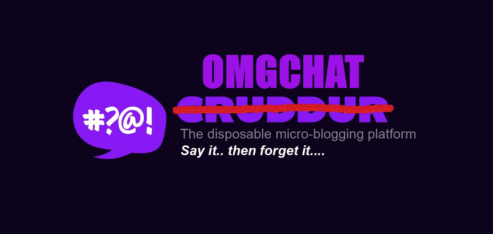
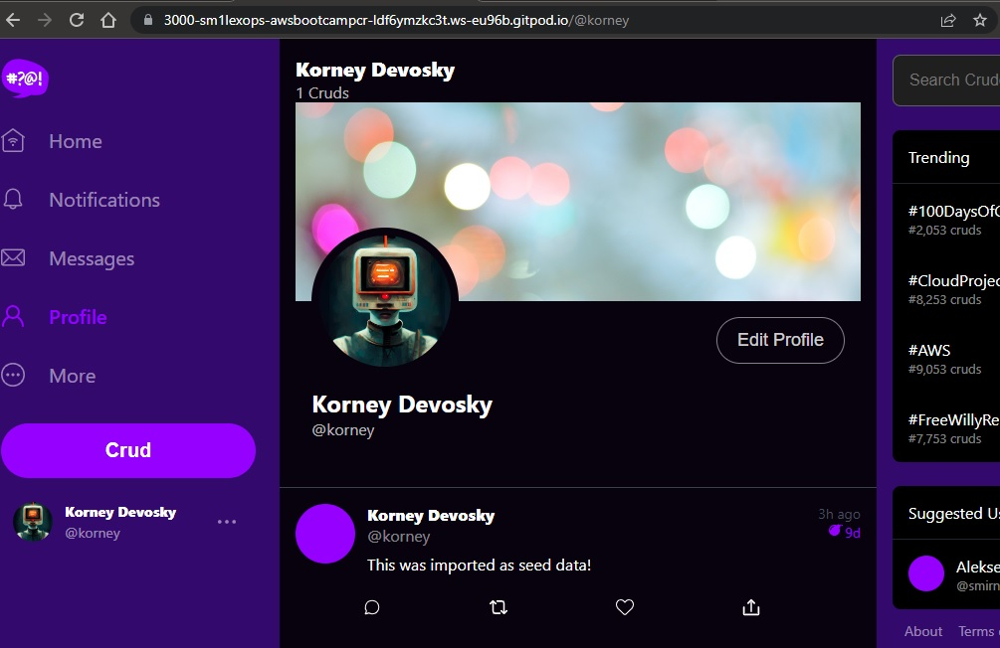
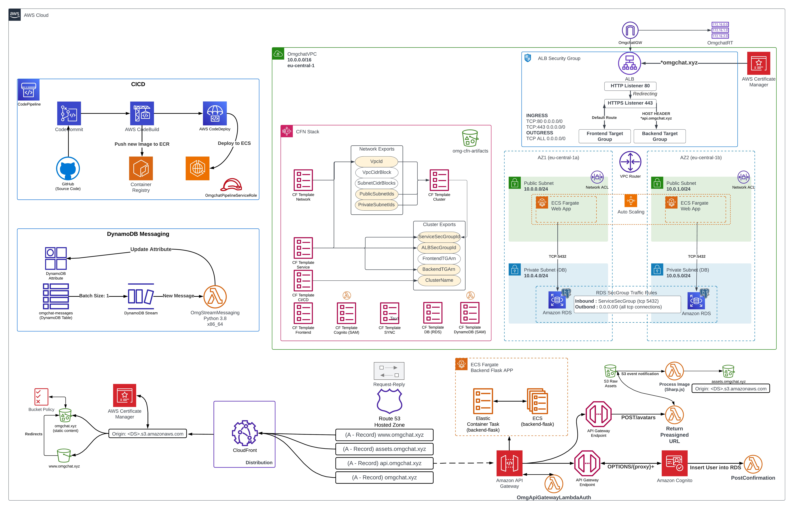
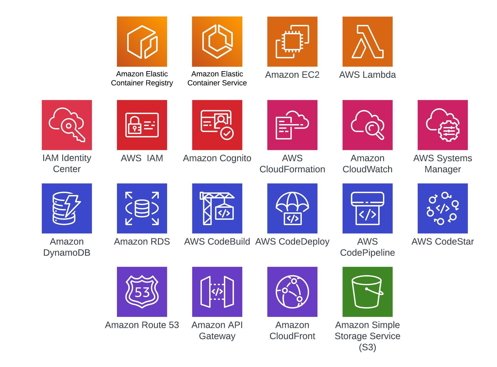

# FREE AWS Cloud Project Bootcamp

- Application: Cruddur => **Omgchat**
- Cohort: 2023-A1

This is the starting codebase that will be used in the FREE AWS Cloud Project Bootcamp 2023

## Instructions

At the start of the bootcamp you need to create a new Github Repository from `week-0` branch.

## Journaling Homework and Completed Chalenges

The `/journal` directory contains

| Submissions | Tutotial |
| :------------: | :--------- |
|- [x] [Week 0](journal/markdown0.md)|[*Architecture and Billing*](journal/week0.md)|   
|- [x] [Week 1](journal/markdown1.md)|[*App Containerization*](journal/week1.md)| 
|- [x] [Week 2](journal/markdown2.md)|[*Observability*](journal/week2.md)| 
|- [x] [Week 3](journal/markdown3.md)|[*Decentralized Authentication*](journal/week3.md)| 
|- [x] [Week 4](journal/markdown4.md)|[*Relational Databases*](journal/week4.md)| 
|- [x] [Week 5](journal/markdown5.md)|[*AWS DynamoDB*](journal/week5.md)| 
|- [x] [Week 6](journal/markdown6.md)|[*Serverless ECS/ECR/ACM/Fargate*](journal/week6.md)| 
|- [x] [Week 7](journal/markdown7.md)|[*Solving CORS with ALB and Route53*](journal/week7.md)| 
|- [x] [Week 8](journal/markdown8.md)|[*Serverless Image Processing*](journal/week8.md)| 
|- [x] [Week 9](journal/markdown9.md)|[*CI/CD with CodePipeline/CodeBuild/CodeDeploy*](journal/week9.md)| 
|- [x] [Week 10](journal/markdown10.md)|[*AWS CloudFormation*](journal/week10.md)| 
|- [x] [Week X](journal/markdownx.md)|[*Cleanup*](journal/weekx.md)| 

## Finall Diagram 

> It's Simplified overview diagram

> Techonlogy and AWS Services we have used 

*It's all about thoughts. Thought is the beginning of everything. And thoughts can be controlled. And therefore the main thing of improvement is to work on thoughts.*
