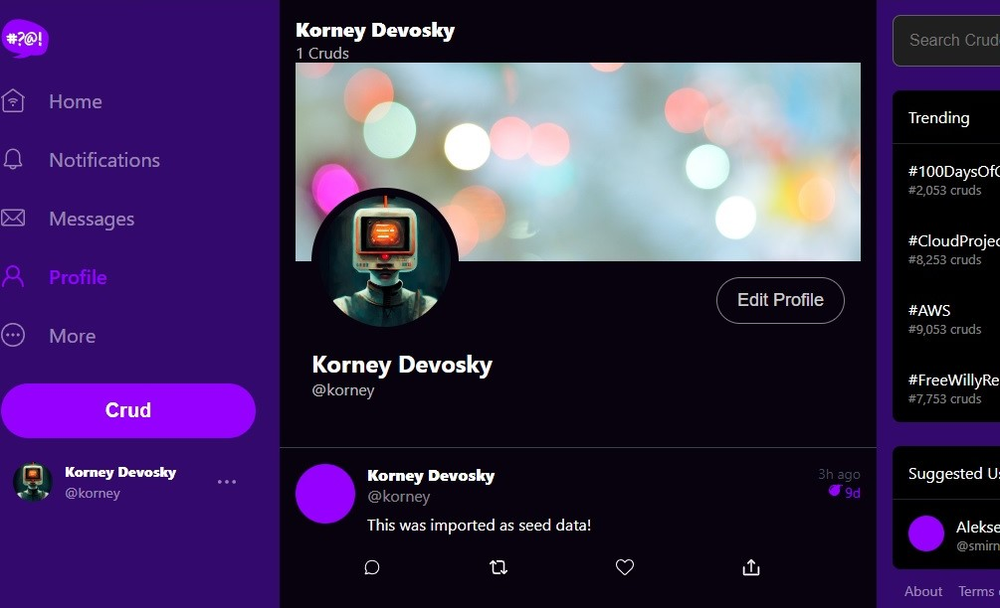

# FREE AWS Cloud Project Bootcamp

- Application: Cruddur => **Omgchat**
- Cohort: 2023-A1

This is the starting codebase that will be used in the FREE AWS Cloud Project Bootcamp 2023

## Instructions

At the start of the bootcamp you need to create a new Github Repository from `week-0` branch.

## Journaling Homework and Completed Chalenges

The `/journal` directory contains

| Submissions | Tutorial |
| :------------: | :--------- |
|<ul><li>- [x] [Week 0](journal/markdown0.md)</li></ul> |[*Architecture and Billing*](journal/week0.md)|   
|<ul><li>- [x] [Week 1](journal/markdown1.md)</li></ul> |[*App Containerization*](journal/week1.md)| 
|<ul><li>- [x] [Week 2](journal/markdown2.md)</li></ul> |[*Observability*](journal/week2.md)| 
|<ul><li>- [x] [Week 3](journal/markdown3.md)</li></ul> |[*Decentralized Authentication*](journal/week3.md)| 
|<ul><li>- [x] [Week 4](journal/markdown4.md)</li></ul> |[*Relational Databases*](journal/week4.md)| 
|<ul><li>- [x] [Week 5](journal/markdown5.md)</li></ul> |[*AWS DynamoDB*](journal/week5.md)| 
|<ul><li>- [x] [Week 6](journal/markdown6.md)</li></ul> |[*Serverless ECS/ECR/ACM/Fargate*](journal/week6.md)| 
|<ul><li>- [x] [Week 7](journal/markdown7.md)</li></ul> |[*Solving CORS with ALB and Route53*](journal/week7.md)| 
|<ul><li>- [x] [Week 8](journal/markdown8.md)</li></ul> |[*Serverless Image Processing*](journal/week8.md)| 
|<ul><li>- [x] [Week 9](journal/markdown9.md)</li></ul> |[*CI/CD with CodePipeline/CodeBuild/CodeDeploy*](journal/week9.md)| 
|<ul><li>- [x] [Week 10](journal/markdown10.md)</li></ul> |[*AWS CloudFormation*](journal/week10.md)| 
|<ul><li>- [x] [Week X](journal/markdownx.md)</li></ul> |[*Cleanup*](journal/weekx.md)| 

## Finall Diagram 

> It's Simplified overview diagram

> Techonlogy and AWS Services we have used 

*It's all about thoughts. Thought is the beginning of everything. And thoughts can be controlled. And therefore the main thing of improvement is to work on thoughts.*
