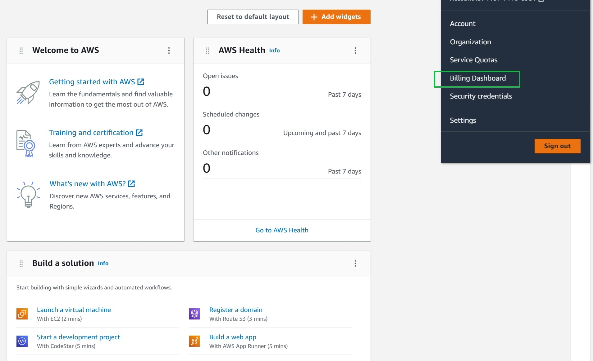

  # Week 0 — Billing and Architecture

  ## Homework Submissions

  - [x] Watched Week-0 Video 
  > [Live Stream Week-0](https://www.youtube.com/watch?v=SG8blanhAOg&list=PLBfufR7vyJJ7k25byhRXJldB5AiwgNnWv&index=13)

  > [Week 0 - Generate Credentials, AWS CLI, Budget and Billing Alarm via CLI](https://www.youtube.com/watch?v=OdUnNuKylHg)

  > [AWS Bootcamp Week 0 - Pricing Basics and Free tier](https://www.youtube.com/watch?v=OVw3RrlP-sI&list=PLBfufR7vyJJ7k25byhRXJldB5AiwgNnWv&index=14) 

  > [AWS Organizations & AWS IAM Tutorial For Beginners - Cloud BootCamp - Week 0](https://www.youtube.com/watch?v=4EMWBYVggQI&list=PLBfufR7vyJJ7k25byhRXJldB5AiwgNnWv&index=16)

  > [AWS Cloud Project Bootcamp YouTube Playlist](https://youtube.com/playlist?list=PLBfufR7vyJJ7k25byhRXJldB5AiwgNnWv)

  - [x] Read all the necessary information

  > [AWS Cloud Project Bootcamp Outline](https://docs.google.com/document/d/19XMyd5zCk7S9QT2q1_Cg-wvbnBwOge7EgzgvtVCgcz0/edit?usp=sharing)

  > [AWS Cloud Project Bootcamp FAQs](https://docs.google.com/document/d/1VEs2i_tm1FxUatu1ZfUZH8EEVlhN9XWpVDvqg7GYeKM/edit?usp=sharing)
  
  > [AWS Cloud Project Bootcamp Surveys](https://docs.google.com/document/d/1XWuCvo2HkCUhqMpJiv0K5fJDKWkkO6AoXP8rnT39vkk/edit?usp=sharing)

  > [AWS Cloud Project Bootcamp Codes of Conduct](https://docs.google.com/document/d/1Rutvjt1uBtq_SbDg-0cmImjHqq5IvGK8FIzW1L-9FDk/edit?usp=sharing)

  > [AWS Cloud Project Bootcamp Sponsorship Package](https://docs.google.com/document/d/1FpVI2fZaji-q2xPj8BIxOWjUjnd7wsYZfxqFc1aa0VY/edit?usp=sharing)
    
  - [x] Created All needed for project account

  > AWS, Lucidcharts, Github/Codespace, Gitpod, Momento, AWS Route 53 (delyourhistory.link), HoneyComb, Rollbar 

  - [x] Clone main branch for cruddur app 
  - [x] Create week-0 branch for Homework submissions 
  - [x] Install AWS CLI for SDE 
  - [x] Create AWS Credentials and Secure Account 
  - [x] Enable Billing and Billing alarm for AWS Account
  - [x] Create AWS Budget

  ## Homework Tasks
  ## Create Napkin Diagramm for our Application

  > My Example

  

  ## Create Conceptual Diagramm

  > My Conceptual Diagramm [Conceptual Diagramm](https://lucid.app/lucidchart/47e0b332-5cb0-4a44-be38-129df91d194c/edit?viewport_loc=71%2C21%2C2113%2C1201%2C0_0&invitationId=inv_0c80c396-af0e-4f34-a650-8be042ab3ad8)

  

  ## Create AWS Logical Architecture Design

  > My example for this project [Lucid Charts Share Link](https://lucid.app/lucidchart/eb621a17-c846-41d6-8a65-f4f78e24fe99/edit?viewport_loc=-349%2C-358%2C3801%2C2161%2C0_0&invitationId=inv_f4254ef2-6662-43ed-8a9f-941cd1dd9a2a)

  
  ## Create AWS Account

  ### To create a new AWS account, go to aws.amazon.com and choose Create an AWS Account.

  - [Create Your AWS Account](https://aws.amazon.com/getting-started/guides/setup-environment/module-one/)

  ## Secure your AWS Account

  - Secure and add MFA for root user [What is MFA](https://docs.aws.amazon.com/IAM/latest/UserGuide/introduction.html)
  - Create additional user at the IAM Dashboard (Optinal: you can creat user with AWS portall or AD login with granular access policy)
  - Set account alias and region
  ### Install AWS CLI

  - [*AWS CLI Install Instructions*](https://docs.aws.amazon.com/cli/latest/userguide/getting-started-version.html)

  ### Install AWS CLI for our SDE Gitpod

  ```sh
  gp init # for initialize our .gitpod.yml conf file
  ```
  ### Add next instructions to .gitpod.yml file

  ```sh
  tasks:
    - name: aws-cli
      env:
        AWS_CLI_AUTO_PROMPT: on-partial
      init: |
        cd /workspace
        curl "https://awscli.amazonaws.com/awscli-exe-linux-x86_64.zip" -o "awscliv2.zip"
        unzip awscliv2.zip
        sudo ./aws/install
        cd $THEIA_WORKSPACE_ROOT
  ```
  ### Set Env Vars

  We will set these credentials for the current bash terminal
  ```
  export AWS_ACCESS_KEY_ID=""
  export AWS_SECRET_ACCESS_KEY=""
  export AWS_DEFAULT_REGION=us-east-1
  ```

  We'll tell Gitpod to remember these credentials if we relaunch our workspaces
  ```
  gp env AWS_ACCESS_KEY_ID=""
  gp env AWS_SECRET_ACCESS_KEY=""
  gp env AWS_DEFAULT_REGION=us-east-1
  ```

  ### Check that the AWS CLI is working and you are the expected user

  ```sh
  aws sts get-caller-identity
  ```

  You should see something like this:
  ```json
  {
      "UserId": "AIFBZRJIQN2ONP4ET4EK4",
      "Account": "655602346534",
      "Arn": "arn:aws:iam::655602346534:user/andrewcloudcamp"
  }
  ```

  ## Enable Billing 

  We need to turn on Billing Alerts to recieve alerts...


  - In your Root Account

  

  - go to the [Billing Page](https://console.aws.amazon.com/billing/)
  - Under `Billing Preferences` Choose `Receive Billing Alerts`
  - Save Preferences

  
  ## Creating a Billing Alarm

  ### Create SNS Topic

  - We need an SNS topic before we create an alarm.
  - The SNS topic is what will delivery us an alert when we get overbilled
  - [aws sns create-topic](https://docs.aws.amazon.com/cli/latest/reference/sns/create-topic.html)

  We'll create a SNS Topic
  ```sh
  aws sns create-topic --name billing-alarm
  ```
  which will return a TopicARN

  We'll create a subscription supply the TopicARN and our Email
  ```sh
  aws sns subscribe \
      --topic-arn TopicARN \
      --protocol email \
      --notification-endpoint your@email.com
  ```

  Check your email and confirm the subscription

  #### Create Alarm

  - [aws cloudwatch put-metric-alarm](https://docs.aws.amazon.com/cli/latest/reference/cloudwatch/put-metric-alarm.html)
  - [Create an Alarm via AWS CLI](https://aws.amazon.com/premiumsupport/knowledge-center/cloudwatch-estimatedcharges-alarm/)
  - We need to update the configuration json script with the TopicARN we generated earlier
  - We are just a json file because --metrics is is required for expressions and so its easier to us a JSON file.

  ```sh
  aws cloudwatch put-metric-alarm --cli-input-json file://aws/json/alarm_config.json
  ```

  ## Create an AWS Budget

  [aws budgets create-budget](https://docs.aws.amazon.com/cli/latest/reference/budgets/create-budget.html)

  Get your AWS Account ID
  ```sh
  aws sts get-caller-identity --query Account --output text
  ```

  - Supply your AWS Account ID
  - Update the json files
  - This is another case with AWS CLI its just much easier to json files due to lots of nested json

  ```sh
  aws budgets create-budget \
      --account-id AccountID \
      --budget file://aws/json/budget.json \
      --notifications-with-subscribers file://aws/json/budget-notifications-with-subscribers.json
  ```