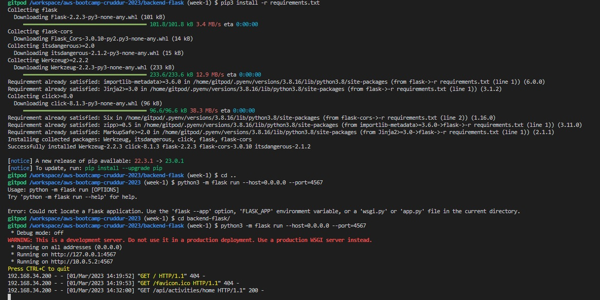
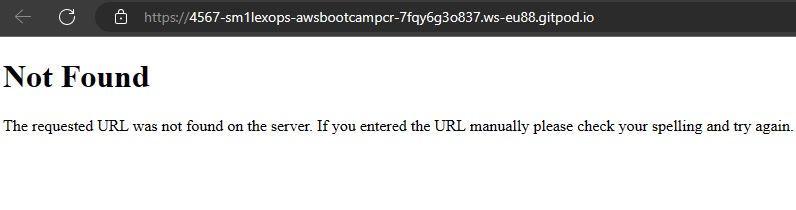
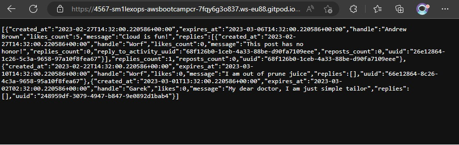
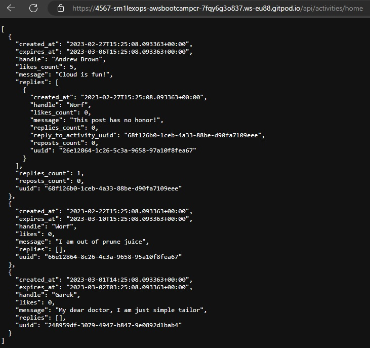
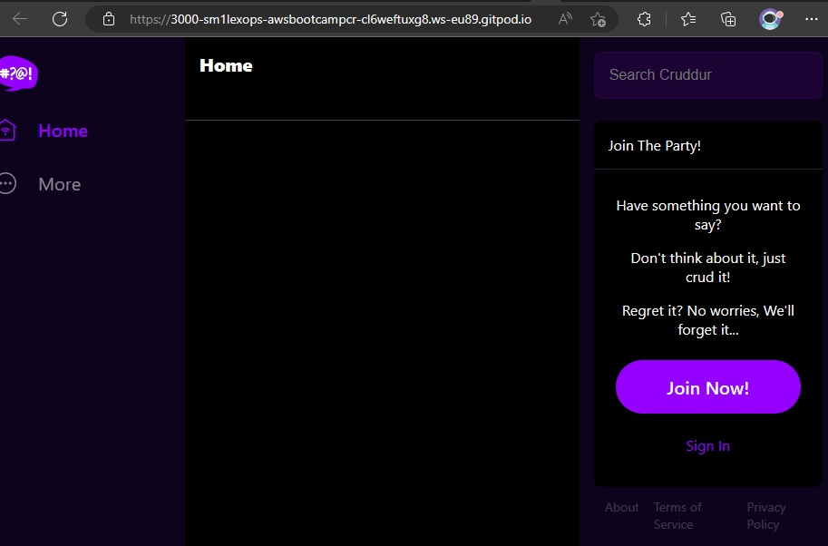
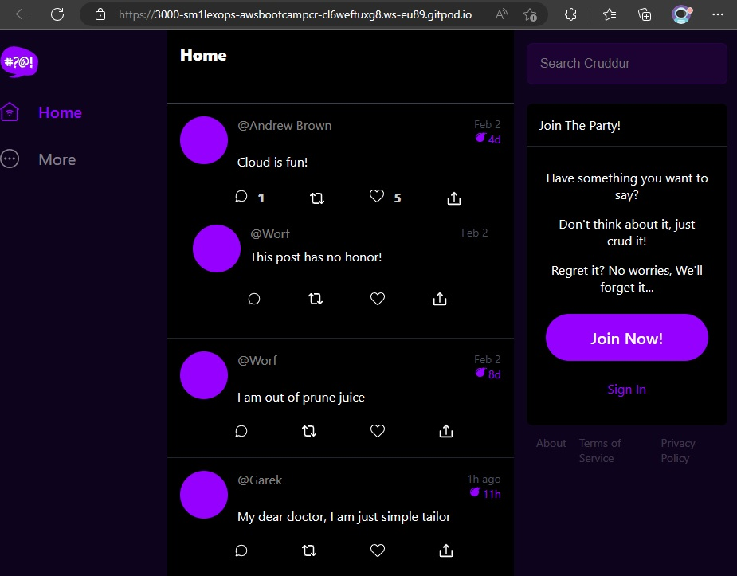
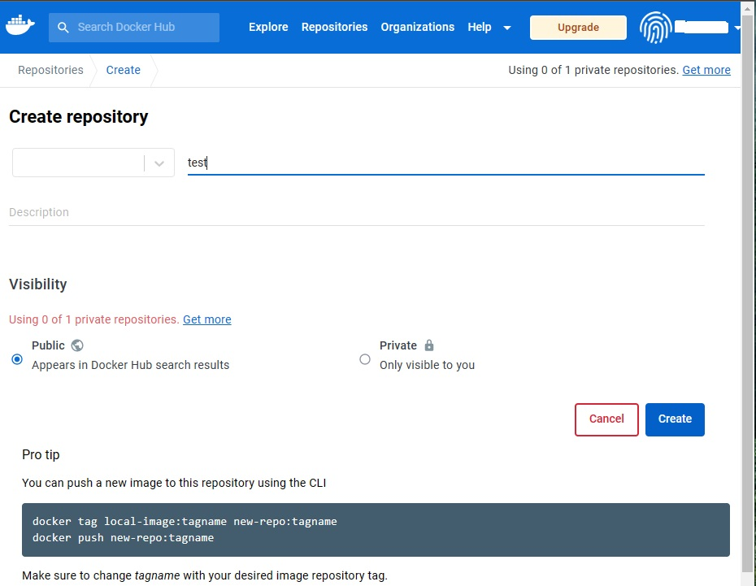
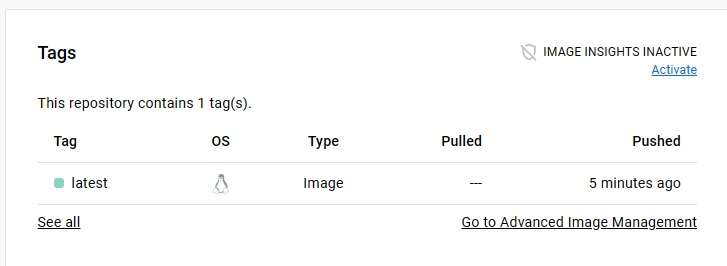
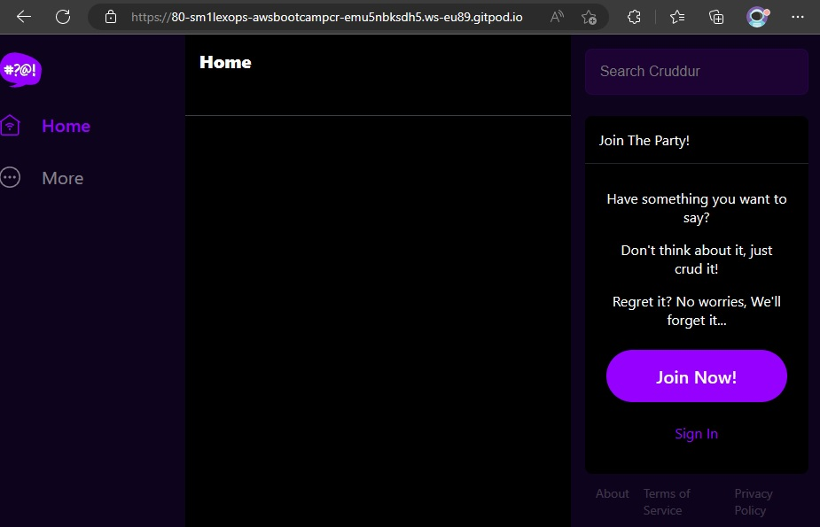
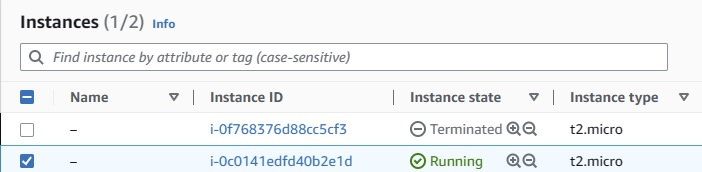

# Week 1 — App Containerization

## Class Summary Tasks

> Check progress [week-1 markdown.md](markdown1.md) 

### Run Python Localy

```sh
cd backend-flask
export FRONTEND_URL="*"
export BACKEND_URL="*"
pip3 install -r requirements.txt
python3 -m flask run --host=0.0.0.0 --port=4567
cd ..
```

> You should see something like this



> Go `PORTS` tab and link to the port 4567



- After appent to the url to `/api/activities/home`

> You should get back srv backend `json` answer



## Create Dockerfile for Backend Application

```sh
FROM python:3.10-slim-buster

WORKDIR /backend-flask

COPY requirements.txt requirements.txt

RUN pip3 install -r requirements.txt

COPY . .

ENV FLASK_ENV=development
ENV FRONTEND_URL=`https://3000-${GITPOD_WORKSPACE_ID}.${GITPOD_WORKSPACE_CLUSTER_HOST}`
ENV BACKEND_URL=`https://4567-${GITPOD_WORKSPACE_ID}.${GITPOD_WORKSPACE_CLUSTER_HOST}`

EXPOSE ${PORT}

CMD [ "python3", "-m", "flask", "run", "--host=0.0.0.0", "--port=4567" ]
```

## Build Container

```sh
docker build -t backend-flask ./backend-flask # build container with name `backend-flask`
```

> You should get status like this

```sh
Successfully built cdd5c72cf552
Successfully tagged backend-flask:latest
```

## Run Container

```sh
docker run --rm -it -p 4567:4567 backend-flask # run container backend-flask in interaction mode, listen port 4567, after `ctrl+C` container will be deleted automaticly
```

> At the end of output you should see

```sh
192.168.34.200 - - [01/Mar/2023 15:24:47] "GET / HTTP/1.1" 404 -
192.168.34.200 - - [01/Mar/2023 15:25:08] "GET /api/activities/home HTTP/1.1" 200 -
```

### Get Running Container ID

```sh
docker ps -a # `"-a"` argument meaning info about `all` container running and stoped
CONTAINER ID   IMAGE           COMMAND                  CREATED         STATUS         PORTS                                       NAMES
99461a672215   backend-flask   "python3 -m flask ru…"   6 minutes ago   Up 6 minutes   0.0.0.0:4567->4567/tcp, :::4567->4567/tcp   fervent_kirch
```

### Get Container Backend JSON

- open the link for 4567 in your browser again
- append to the url to /api/acivities/home

> You should get back json like this



### Put Container ID into an Environment Variable

```sh
CONTAINER_ID=$(docker ps -aq)
```

### Send curl to Test Server

```sh
curl -X GET http://localhost:4567/api/activities/home -H "Accept: application/json" -H "Content-Type: application/json"
```

> You'll get same json answer

### You Can Get Container Logs

```sh
docker logs CONTAINER_ID -f
docker logs backend-flask -f
docker logs $CONTAINER_ID -f
```

### Debugging adjacent containers with other containers

```sh
docker run --rm -it curlimages/curl /bin/bash $(curl -X GET http://localhost:4567/api/activities/home -H \"Accept: application/json\" -H \"Content-Type: application/json\")
```

> You should get back answer from adjacent containers like this

```sh
gitpod /workspace/aws-bootcamp-cruddur-2023 (week-1) $ docker run --rm -it curlimages/curl /bin/bash $(curl -X GET http://localhost:4567/api/activities/home -H \"Accept: application/json\" -H \"Content-Type: application/json\")
  % Total    % Received % Xferd  Average Speed   Time    Time     Time  Current
                                 Dload  Upload   Total   Spent    Left  Speed
100  1235  100  1235    0     0   402k      0 --:--:-- --:--:-- --:--:--  402k
  % Total    % Received % Xferd  Average Speed   Time    Time     Time  Current
                                 Dload  Upload   Total   Spent    Left  Speed
  0     0    0     0    0     0      0      0 --:--:-- --:--:-- --:--:--     0curl: (6) Could not resolve host: application
  % Total    % Received % Xferd  Average Speed   Time    Time     Time  Current
                                 Dload  Upload   Total   Spent    Left  Speed
  0     0    0     0    0     0      0      0 --:--:-- --:--:-- --:--:--     0curl: (6) Could not resolve host: application
curl: (3) URL using bad/illegal format or missing URL
curl: (3) bad range specification in URL position 2:
```

### For Debuging you can use `busybosy` container

```sh
docker run --rm -it busybosy
```

> Gain Access to Container CLI

```sh
docker exec CONTAINER_ID -it /bin/bash
```

> You can get all additional information about working with containers
[Docker Tutorial Link](https://docs.docker.com/get-started/)

## Create Dockerfile for Frontend Application

### First Install npm to Get Dependencies from /node_modules

```sh
cd frontend-react-js
npm i
```

> You'll have /node_modules directory, run `ll` in cli to check it

### Create Dockerfile

> place Dockerfile here: `frontend-react-js/Dockerfile

```sh
FROM node:16.18

WORKDIR /frontend-react-js

COPY . /frontend-react-js/

RUN npm install

ENV PORT=3000

EXPOSE ${PORT}

CMD [ "npm", "start" ]
```

### Build Frontend App Container

```sh
docker build -t frontend-react-js ./frontend-react-js
```

### Run Frontend Container

```sh
docker run -d -p 3000:3000 frontend-react-js
```

> Go To `PORTS` Tab, make public port 3000 and click on the link

If you see start home page your application `CONGRATULATIONS👋!!!`



## Manage Multiple Containers

### Create `docker-compose.yml` at the root of your project

```sh
version: "3.8"
services:
  backend-flask:
    environment:
      FRONTEND_URL: "https://3000-${GITPOD_WORKSPACE_ID}.${GITPOD_WORKSPACE_CLUSTER_HOST}"
      BACKEND_URL: "https://4567-${GITPOD_WORKSPACE_ID}.${GITPOD_WORKSPACE_CLUSTER_HOST}"
    build: ./backend-flask
    ports:
      - "4567:4567"
    volumes:
      - ./backend-flask:/backend-flask
  frontend-react-js:
    environment:
      REACT_APP_BACKEND_URL: "https://4567-${GITPOD_WORKSPACE_ID}.${GITPOD_WORKSPACE_CLUSTER_HOST}"
    build: ./frontend-react-js
    ports:
      - "3000:3000"
    volumes:
      - ./frontend-react-js:/frontend-react-js

# the name flag is a hack to change the default prepend folder
# name when outputting the image names
networks: 
  internal-network:
    driver: bridge
    name: delyourhistory
```

> Check that you don't run any containers

```sh
docker ps -a
```

> If containers exists delete them all

```sh
docker rm -f $(docker ps -aq)
```

> Next you can run docker-compose.yml file

```sh
docker compose -f "docker-compose.yml" up -d --build
```

> If all stage complete success on cli you should get output

```sh
[+] Running 3/3
 ✔ Network aws-bootcamp-cruddur-2023_default                Created                                                                                                         0.0s 
 ✔ Container aws-bootcamp-cruddur-2023-frontend-react-js-1  Started                                                                                                         0.6s 
 ✔ Container aws-bootcamp-cruddur-2023-backend-flask-1      Started                                                                                                         0.6s 
 *  Terminal will be reused by tasks, press any key to close it. 
 ```

 > And you'll see in your frontend new picture with backend

 

## Adding DynamoDB Local and Postgres

> We are going to use Postgres and DynamoDB local in future labs We can bring them in as containers and reference them externally
Lets integrate the following into our existing docker compose file:

### Postgres

```sh

services:
  db:
    image: postgres:13-alpine
    restart: always
    environment:
      - POSTGRES_USER=postgres
      - POSTGRES_PASSWORD=password
    ports:
      - '5432:5432'
    volumes: 
      - db:/var/lib/postgresql/data
volumes:
  db:
    driver: local
```

> To install the postgres client into Gitpod add next line to .gitpod.yml

```sh
  - name: postgres
    init: |
      curl -fsSL https://www.postgresql.org/media/keys/ACCC4CF8.asc|sudo gpg --dearmor -o /etc/apt/trusted.gpg.d/postgresql.gpg
      echo "deb http://apt.postgresql.org/pub/repos/apt/ `lsb_release -cs`-pgdg main" |sudo tee  /etc/apt/sources.list.d/pgdg.list
      sudo apt update
      sudo apt install -y postgresql-client-13 libpq-dev
```

### DynamoDB Local

```sh

services:
  dynamodb-local:
    # https://stackoverflow.com/questions/67533058/persist-local-dynamodb-data-in-volumes-lack-permission-unable-to-open-databa
    # We needed to add user:root to get this working.
    user: root
    command: "-jar DynamoDBLocal.jar -sharedDb -dbPath ./data"
    image: "amazon/dynamodb-local:latest"
    container_name: dynamodb-local
    ports:
      - "8000:8000"
    volumes:
      - "./docker/dynamodb:/home/dynamodblocal/data"
    working_dir: /home/dynamodblocal
```

Example of using DynamoDB local
<https://github.com/100DaysOfCloud/challenge-dynamodb-local>

> After All We Can Make Change while we Coding

## Homework Challenges

### - [x] Run the Dockerfile CMD as an external script

> Create at the `backend-flask` cmd_docker.sh script

```sh
#!/bin/bash -xe
python3 -m flask run --host=0.0.0.0 --port=4567 
```
  
> Change Dockerfile 

```sh
COPY cmd_docker.sh cmd_docker.sh # add this line to put script into container
CMD [ "bash", "cmd_docker.sh" ] # change CMD command to run the script
```

### - [x] Push and tag a image to DockerHub

> First need to create dockerhub account and repository

 Go to the https://hub.docker.com/ in the navigation bar go to the `Repositories` and create public repo



> Tag your local image and push to the DockerHub

```sh
docker tag awsbootcamp:latest <yournamedockerhub>/<reponame_dockerhub>:<tag>
docker push <yournamedockerhub>/<reponame_dockerhub>:<tag>
```

> If all is fine, you should see something like this

```sh
1959218cc351: Pushed 
d412d872f329: Mounted from library/python 
latest: digest: sha255:97feff57a3587fea6e0178358204793e9eeab7087be3686b82eeb3971c698d78 size: 2203
```

> and you'll see new tag image in DockerHub 



### - [x]  Create Multi-Stage Building Dockerfile

> First we build container with all dependencies, then copy this app to nginx

```sh
FROM node:16.18 as build

WORKDIR /app

COPY package.json package-lock.json ./

RUN npm install

COPY . ./

RUN npm run build
# stage 2
FROM nginx:1.16.0-alpine

WORKDIR /usr/share/nginx/html

RUN rm -rf ./*
 
COPY --from=build /app/build .

EXPOSE 80

ENTRYPOINT [ "nginx", "-g", "daemon off;" ]
```

> You can `notice` our nginx container with all dependencies have a smaller size, in my case this 22MB vs 129MB

```sh
gitpod /workspace/aws-bootcamp-cruddur-2023 (week-1) $ docker images
REPOSITORY                                    TAG                IMAGE ID       CREATED          SIZE
crud_multistage                               latest             977abba0e2ef   31 minutes ago   22.2MB
awsbootcamp                                   latest             b07335cde236   4 hours ago      129MB
```

> Best practise use multi-stage building container for production

```sh
docker run --rm -it -p 80:80 crud_multistage
```

> Start lightweight container and go `PORT` 80, you should see



### - [x] Implement a Healthcheck in the docker-compose v3 file

> You need add this to our docker-compose.yml file

```sh
    healthcheck:
      # This property specifies the command that will be executed and is the health check of the container. This command HAS TO be available and working if everything is set up correctly.
      test: curl --fail http://localhost || exit 1
      # specifies the number of seconds to initially wait before executing the health check and then the frequency at which subsequent health checks will be performed.
      interval: 60s
      # specifies the number of consecutive health check failures required to declare the container as unhealthy.
      retries: 5
      # specifies the number of seconds your container needs to bootstrap. During this period, health checks with an exit code greater than zero won’t mark the container as unhealthy; however, a status code of 0 will mark the container as healthy.
      start_period: 20s
      # specifies the number of seconds Docker awaits for your health check command to return an exit code before declaring it as failed.
      timeout: 10s
```

### - [x] Install Docker Localy

> We can use official tutorial for [installing docker on Ubuntu](https://docs.docker.com/engine/install/ubuntu/) or other OS

#### Uninstall Old Version

```sh
sudo apt-get remove docker docker-engine docker.io containerd runc
```

#### Install using the repository

> Update the apt package index and install packages to allow apt to use a repository over HTTPS:

```sh
sudo apt-get update
sudo apt-get install \
    ca-certificates \
    curl \
    gnupg \
    lsb-release
```

> Add Docker’s official GPG key:

```sh
sudo mkdir -m 0755 -p /etc/apt/keyrings
curl -fsSL https://download.docker.com/linux/ubuntu/gpg | sudo gpg --dearmor -o /etc/apt/keyrings/docker.gpg
```

> Use the following command to set up the repository:

```sh
echo \
  "deb [arch=$(dpkg --print-architecture) signed-by=/etc/apt/keyrings/docker.gpg] https://download.docker.com/linux/ubuntu \
  $(lsb_release -cs) stable" | sudo tee /etc/apt/sources.list.d/docker.list > /dev/null
```

#### Install Docker Engine

> To install the latest version, run:

```sh
sudo apt-get update
#if problem with gpg 
sudo chmod a+r /etc/apt/keyrings/docker.gpg
sudo apt-get update
sudo apt-get install docker-ce docker-ce-cli containerd.io docker-buildx-plugin docker-compose-plugin
#run first container
sudo docker run hello-world
```

> If you have an issue with `permission denied` run docker command

```sh
sudo groupadd docker
sudo usermod -aG docker $USER
sudo reboot
```
### Launch EC2 instance, install Docker and pull container

> Launch EC2 instance and get .pem private key for ssh connection



> Install Docker and pull container

```sh
smirnov@ip-0-0:~$ docker pull nginx
Using default tag: latest
latest: Pulling from library/nginx
3f9582a2cbe7: Pull complete
9a8c6f286718: Pull complete
e81b85700bc2: Pull complete
73ae4d451120: Pull complete
6058e3569a68: Pull complete
3a1b8f201356: Pull complete
Digest: sha256:aa0afebbb3cfa473099a62c4b32e9b3fb73ed23f2a75a65ce1d4b4f55a5c2ef2
Status: Downloaded newer image for nginx:latest
docker.io/library/nginx:latest
```
