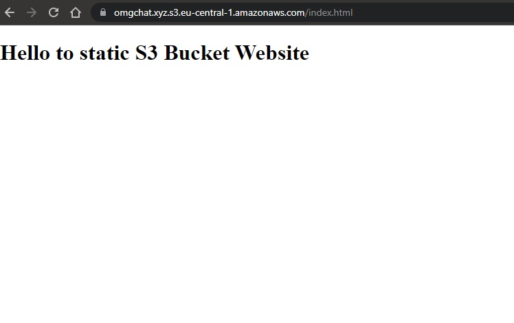

# Week 10 — CloudFormation Part 1

*This week we'll study how to use CloudFormation for our Project.*

*Be patient during **Hardest** but very **Exciting** week-10*

- [Preparation](#preparation)

- [Network CloudFormation Template](#network-cloudformation-template)

- [Cluster CloudFormation Template](#cluster-cloudformation-template)

- [AWS RDS Postgresql CloudFormation Template](#aws-rds-postgresql-cloudformation-template)

- [Services CloudFormation Template](#services-cloudformation-template)

- [Frontend CloudFormation Template](#frontend-cloudformation-template)

- [CICD CloudFormation Template](#cicd-cloudformation-template)

- [Summary](#summary)

## Preparation

> Full template example [AWS CloudFormation Template ECS snippets](https://docs.aws.amazon.com/AWSCloudFormation/latest/UserGuide/quickref-ecs.html#quickref-ecs-example-1.yaml)

* First of all you can delete all resources, all your `HARD WORK`, but I don't advice doing that, the best choice is to create new `namespace` and change name for all services and resources.

* In my case, I was deleting all resources and should change `Route 53` record for new `ALB`. In that case you'll have new VPC, SecGroup and some other kind of stuff for troubleshooting.

## Network CloudFormation Template

> In all cases for sending ENV VAR to cfn `template.yaml`  we using `parameters.json` file

* Create >> link to file at github repo >>[`template.yaml`](https://github.com/sm1lexops/aws-bootcamp-cruddur-2023/blob/week-10/aws/cfn/network/template.yaml) for network cfn stack.

* Create [`network-deploy`](https://github.com/sm1lexops/aws-bootcamp-cruddur-2023/blob/week-10/bin/cfn/network-deploy) script for deploy cfn stack.

> `network-deploy`

```sh
#! /usr/bin/env bash 
set -e
CYAN='\033[1;36m'
NO_COLOR='\033[0m'
LABEL="===== Network stack CloudFormation deploy ====="
printf "${CYAN}==== ${LABEL}${NO_COLOR} ${CYAN}======${NO_COLOR}\n"
CFN_PATH="/workspace/aws-bootcamp-cruddur-2023/aws/cfn/network/template.yaml"
STACK_NAME="OmgNet"
BUCKET="omg-cfn-artifact"

aws cloudformation deploy \
    --stack-name $STACK_NAME \
    --s3-bucket $BUCKET \
    --s3-prefix networking \
    --template-file $CFN_PATH \
    --no-execute-changeset \
    --tags group=omgchat-network \
    --capabilities CAPABILITY_NAMED_IAM
```
* `Execute change set` at AWS CloudFormation console.

*Check execution, try resolve issues if needed*

## Cluster CloudFormation Template

* Create >> link to file at github repo >>[`template.yaml`](https://github.com/sm1lexops/aws-bootcamp-cruddur-2023/blob/week-10/aws/cfn/cluster/template.yaml) for cluster cfn stack.

* Create [`parameters.json`](https://github.com/sm1lexops/aws-bootcamp-cruddur-2023/blob/week-10/aws/cfn/cluster/parameters.json)

```json
[
    {
      "ParameterKey": "FrontendHealthCheckIntervalSeconds",
      "ParameterValue": "15"
    }
]
```

* Create [`cluster-deploy`](https://github.com/sm1lexops/aws-bootcamp-cruddur-2023/blob/week-10/bin/cfn/cluster-deploy) script for deploy cluster cfn stack.

> `cluster-deploy`

```sh
#! /usr/bin/env bash 
set -e
CYAN='\033[1;36m'
NO_COLOR='\033[0m'
LABEL="===== Cluster CloudFormation deploy ====="
printf "${CYAN}==== ${LABEL}${NO_COLOR} ${CYAN}======${NO_COLOR}\n"

CFN_PATH="/workspace/aws-bootcamp-cruddur-2023/aws/cfn/cluster/template.yaml"
CFN_PARAM="file:///workspace/aws-bootcamp-cruddur-2023/aws/cfn/cluster/parameters.json"
REGION="eu-central-1"
STACK_NAME="OmgCluster"
BUCKET="omg-cfn-artifact"

aws cloudformation deploy \
    --stack-name $STACK_NAME \
    --s3-bucket $BUCKET \
    --s3-prefix cluster \
    --region $REGION \
    --template-file $CFN_PATH \
    --no-execute-changeset \
    --parameter-overrides $CFN_PARAM \
    --tags group=omgchat-cluster \
    --capabilities CAPABILITY_NAMED_IAM
```

## AWS RDS Postgresql CloudFormation Template

* Create >> link to file at github repo >>[`template.yaml`](https://github.com/sm1lexops/aws-bootcamp-cruddur-2023/blob/week-10/aws/cfn/db/template.yaml) for db cfn stack.

* Create [`parameters.json`](https://github.com/sm1lexops/aws-bootcamp-cruddur-2023/blob/week-10/aws/cfn/db/parameters.json)

```json
[
    {
      "ParameterKey": "MasterUserName",
      "ParameterValue": "omgroot"
    },
    {
      "ParameterKey": "MasterUserPassword",
      "ParameterValue": "$DB_PASSWORD"
    }
  ]
```

* Create [`cluster-deploy`](https://github.com/sm1lexops/aws-bootcamp-cruddur-2023/blob/week-10/bin/cfn/db-deploy) script for deploy db cfn stack.

> `db-deploy`

```sh
#! /usr/bin/env bash 
set -e
CYAN='\033[1;36m'
NO_COLOR='\033[0m'
LABEL="=====  Database CloudFormation deploy ====="
printf "${CYAN}==== ${LABEL}${NO_COLOR} ${CYAN}======${NO_COLOR}\n"
CFN_PATH="/workspace/aws-bootcamp-cruddur-2023/aws/cfn/db/template.yaml"
CFN_PARAM="file:///workspace/aws-bootcamp-cruddur-2023/aws/cfn/db/parameters.json"
REGION="eu-central-1"
STACK_NAME="OmgDb"
BUCKET="omg-cfn-artifact"

aws cloudformation deploy \
  --stack-name $STACK_NAME \
  --s3-bucket $BUCKET \
  --s3-prefix db \
  --region $REGION \
  --template-file $CFN_PATH \
  --no-execute-changeset \
  --tags group=omgchat-db \
  --parameter-overrides $CFN_PARAM \
  --capabilities CAPABILITY_NAMED_IAM
```

## Services CloudFormation Template

* Create >> link to file at github repo >>[`template.yaml`](https://github.com/sm1lexops/aws-bootcamp-cruddur-2023/blob/week-10/aws/cfn/services/template.yaml) for services cfn stack.

* Create [`parameters.json`](https://github.com/sm1lexops/aws-bootcamp-cruddur-2023/blob/week-10/aws/cfn/services/parameters.json)

```json
[
    {
      "ParameterKey": "EnvFrontendUrl",
      "ParameterValue": "https://omgchat.xyz"
    },
    {
      "ParameterKey": "EnvFrontendUrl",
      "ParameterValue": "https://omgchat.xyz"
    },
    {
      "ParameterKey": "DDBMessageTable",
      "ParameterValue": "OmgDdb-DynamoDBTable-G12N0ET4TBR0"
    }
  ]
```

* Create [`services-deploy`](https://github.com/sm1lexops/aws-bootcamp-cruddur-2023/blob/week-10/bin/cfn/db-deploy) script for deploy services cfn stack.

> `services-deploy`

```sh
#! /usr/bin/env bash 
set -e
CYAN='\033[1;36m'
NO_COLOR='\033[0m'
LABEL="===== Services stack CloudFormation deploy ====="
printf "${CYAN}==== ${LABEL}${NO_COLOR} ${CYAN}======${NO_COLOR}\n"
CFN_PATH="/workspace/aws-bootcamp-cruddur-2023/aws/cfn/services/template.yaml"
CFN_PARAM="file:///workspace/aws-bootcamp-cruddur-2023/aws/cfn/services/parameters.json"
REGION="eu-central-1"
STACK_NAME="OmgSrvBackendFlask"
BUCKET="omg-cfn-artifact"

aws cloudformation deploy \
    --stack-name $STACK_NAME \
    --s3-bucket $BUCKET \
    --s3-prefix services \
    --region $REGION \
    --template-file $CFN_PATH \
    --no-execute-changeset \
    --tags group=omgchat-backend-flask \
    --parameter-overrides $CFN_PARAM \
    --capabilities CAPABILITY_NAMED_IAM
```

## Frontend CloudFormation Template

> For Route53 services you'll needed certificate `arn` from `us-east-1`, because CloudFront services using global cert

* Create >> link to file at github repo >>[`template.yaml`](https://github.com/sm1lexops/aws-bootcamp-cruddur-2023/blob/week-10/aws/cfn/frontend/template.yaml) for frontend cfn stack.

* Create [`parameters.json`](https://github.com/sm1lexops/aws-bootcamp-cruddur-2023/blob/week-10/aws/cfn/frontend/parameters.json)

```json
[
    {
      "ParameterKey": "RootBucketName",
      "ParameterValue": "omgchat.xyz"
    },
    {
      "ParameterKey": "WwwBucketName",
      "ParameterValue": "www.omgchat.xyz"
    },
    {
      "ParameterKey": "CertificateArn",
      "ParameterValue": "arn:aws:acm:us-east-1:446273730290:certificate/ac26cd1c-f835-49a7-9139-30630f24452a"
    }
]
```

* Create [`frontend-deploy`](https://github.com/sm1lexops/aws-bootcamp-cruddur-2023/blob/week-10/bin/cfn/frontend-deploy) script for frontend services cfn stack.

> `frontend-deploy`

```sh
#! /usr/bin/env bash 
set -e
CYAN='\033[1;36m'
NO_COLOR='\033[0m'
LABEL="===== Frontend CloudFormation deploy ====="
printf "${CYAN}==== ${LABEL}${NO_COLOR} ${CYAN}======${NO_COLOR}\n"
CFN_PATH="/workspace/aws-bootcamp-cruddur-2023/aws/cfn/frontend/template.yaml"
PARAMETERS="file:///workspace/aws-bootcamp-cruddur-2023/aws/cfn/frontend/parameters.json"

cfn-lint $CFN_PATH

REGION="eu-central-1"
STACK_NAME="OmgFrontend"
BUCKET="omg-cfn-artifact"

aws cloudformation deploy \
  --template-file $CFN_PATH \
  --stack-name $STACK_NAME \
  --s3-bucket $BUCKET \
  --s3-prefix frontend \
  --region $REGION \
  --no-execute-changeset \
  --tags group=omgchat-frontend \
  --parameter-overrides $PARAMETERS \
  --capabilities CAPABILITY_NAMED_IAM
```

* Create `index.html` file, for testing your static web site access 

> `index.html`

```html
<!doctype html>
<head>
  <meta charset="utf-8">
  <meta name="description" content="">

  <title>Omgchat for Anybody</title>

  <link rel="stylesheet" href="http://yui.yahooapis.com/3.5.1/build/cssreset/cssreset-min.css">
  <link rel="stylesheet" href="styles.css">
  
</head>
<body>
    <section id="header">
    </section>
<h1>Hello to static S3 Bucket Website</h1>
    <section id="main">
    </section>

    <section id="footer">
    </section>
    
</body>
</html>
```

> Check access to web site in my example `omgchat.xyz`

 

## CICD CloudFormation Template

> CICD Planning

* Create CloudFormation Template

* Create cicd-deploy script, tmp dir for output package

* Create at cicd directory nested directory for `codebuild.yaml` cfn CodeBuild template file

* Create artifact bucket

* Authorize to Github, update pending connections for pipeline

* Update branch, merge `week-10` to `prod` branch to initiate pipeline

* Create >> link to file at github repo >>[`template.yaml`](https://github.com/omenking/aws-bootcamp-cruddur-2023/blob/week-10-again/aws/cfn/cicd/template.yaml) for cicd cfn stack.

* Create [`codebuild.yaml`](https://github.com/omenking/aws-bootcamp-cruddur-2023/blob/week-10-again/aws/cfn/cicd/nested/codebuild.yaml)


* Create [`cicd-deploy`](https://github.com/sm1lexops/aws-bootcamp-cruddur-2023/blob/week-10/bin/cfn/db-deploy) script for deploy cicd cfn stack.

> `cicd-deploy`

```sh
#! /usr/bin/env bash
#set -e # stop the execution of the script if it fails

CFN_PATH="/workspace/aws-bootcamp-cruddur-2023/aws/cfn/cicd/template.yaml"
CONFIG_PATH="/workspace/aws-bootcamp-cruddur-2023/aws/cfn/cicd/config.toml"
PACKAGED_PATH="/workspace/aws-bootcamp-cruddur-2023/tmp/packaged-template.yaml"
PARAMETERS=$(cfn-toml params v2 -t $CONFIG_PATH)
echo $CFN_PATH

cfn-lint $CFN_PATH

BUCKET=$(cfn-toml key deploy.bucket -t $CONFIG_PATH)
REGION=$(cfn-toml key deploy.region -t $CONFIG_PATH)
STACK_NAME=$(cfn-toml key deploy.stack_name -t $CONFIG_PATH)

# package
# -----------------
echo "== packaging CFN to S3..."
aws cloudformation package \
  --template-file $CFN_PATH \
  --s3-bucket $BUCKET \
  --s3-prefix cicd-package \
  --region $REGION \
  --output-template-file "$PACKAGED_PATH"

aws cloudformation deploy \
  --stack-name $STACK_NAME \
  --s3-bucket $BUCKET \
  --s3-prefix cicd \
  --region $REGION \
  --template-file "$PACKAGED_PATH" \
  --no-execute-changeset \
  --tags group=cruddur-cicd \
  --parameter-overrides $PARAMETERS \
  --capabilities CAPABILITY_NAMED_IAM
```
## Summary

All issues happened with AWS CloudFormation related to the Route53 service, A records, and ALB. It is good practice to check templates using the cfn-lint library before executing deployment of CFN stacks. If a deployment encounters any issues with long execution times, it is recommended to check the related services and policies in the AWS console.
