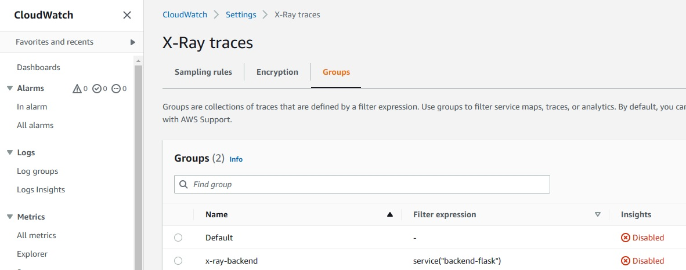
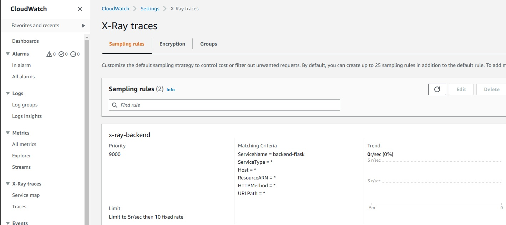

# Week 2 — Distributed Tracing

## Class Summary Tasks

## Honeycomb.io

Instrument our backend flask application to use Open Telemetry (OTEL) with Honeycomb.io as the provider

> For implementation our OTEL to backend using [Installation instraction OTEL for Python](https://docs.honeycomb.io/getting-data-in/opentelemetry/python/)

Just add to `requirements.txt` following line of code, notice we working with `/backend-flask/` directory 

```sh
opentelemetry-api 
opentelemetry-sdk 
opentelemetry-exporter-otlp-proto-http 
opentelemetry-instrumentation-flask 
opentelemetry-instrumentation-requests
```

> Install this dependencies

```sh
pip install -r requirements.txt
```

> Next add this line to `app.py` 

```sh
from opentelemetry import trace
from opentelemetry.instrumentation.flask import FlaskInstrumentor
from opentelemetry.instrumentation.requests import RequestsInstrumentor
from opentelemetry.exporter.otlp.proto.http.trace_exporter import OTLPSpanExporter
from opentelemetry.sdk.trace import TracerProvider
from opentelemetry.sdk.trace.export import BatchSpanProcessor
```

> Initialize tracing and an exporter that can send data to Honeycomb

```sh
provider = TracerProvider()
processor = BatchSpanProcessor(OTLPSpanExporter())
provider.add_span_processor(processor)
trace.set_tracer_provider(provider)
tracer = trace.get_tracer(__name__)
```

> Initialize automatic instrumentation with Flask

```sh
app = Flask(__name__)
FlaskInstrumentor().instrument_app(app)
RequestsInstrumentor().instrument()
```

> Add following ENV VARIABLES to our `docker-compose.yml`

```sh
OTEL_EXPORTER_OTLP_ENDPOINT: "https://api.honeycomb.io"
OTEL_EXPORTER_OTLP_HEADERS: "x-honeycomb-team=${HONEYCOMB_API_KEY}"
OTEL_SERVICE_NAME: "${HONEYCOMB_SERVICE_NAME}"
```

> Grab your [API KEY](assets/api-key-honeycomb.jpg) and export to the ENV VAR

```sh
export HONEYCOMB_API_KEY="<your API key>"
export HONEYCOMB_SERVICE_NAME="Cruddur"
gp env HONEYCOMB_API_KEY="<your API key>"
gp env HONEYCOMB_SERVICE_NAME="Cruddur"
```

> Up your application with `docker-compose.yml"

```sh
docker compose up
```

> Go `PORT` tab make public ports `3000, 4567`, go 4567 link, paste at the end URL `/api/activities/home`

Update your page few times for generate some data

> If All is Fine you should get some spans


> Adding Attributes and Nested Spans

For getting information, for example, how your services is working when recieving api call and how long it lasted

```sh
...

with tracer.start_as_current_span("home-activities-data") as outer_span:
    outer_span.set_attribute("outer", True)
    span = trace.get_current_span()
    span.set_attribute("app.hubabuba", now.isoformat())
    ...
    
    with tracer.start_as_current_span("home-result-activities") as inner_span:
        inner_span.set_attribute("inner", True)
        span = trace.get_current_span()
        span.set_attribute("app.hubabuba", now.isoformat())
    ...
# `return results` end your home_activities.py service file
```

> If you generate new data you'll get sub spans with attribute value


> Alson you can run some Query to sort your data


## AWS X-Ray

### Instrument AWS X-Ray for Flask

> Add sdk library to the `requirements.txt`

```sh
aws-xray-sdk
```

> Install dependencies for python

```sh
pip install -r requirements.txt
```

> Add to `app.py`

```sh
from aws_xray_sdk.core import xray_recorder
from aws_xray_sdk.ext.flask.middleware import XRayMiddleware
...

xray_url = os.getenv("AWS_XRAY_URL")
xray_recorder.configure(service='Cruddur', dynamic_naming=xray_url)
XRayMiddleware(app, xray_recorder)
```
## Add X-Ray Daemon for Docker Compose

### Check your CLI credentials for AWS

*Don't use AWS_SESSION_KEY, X-Ray can't sent the data*

> You need to create an `Access Key` in the AWS console and check your credentials

```sh
env | grep AWS
...
gp env | grep AWS # 
```

*Credentials in your SDE should be the same*

> Create group for X-Ray by CLI

```sh
aws xray create-group \
   --group-name "x-ray-backend" \
   --filter-expression "service(\"backend-flask\") {fault OR error}"
```

You should get json answer like this

```sh
{
    "Group": {
        "GroupName": "Cruddur",
        "GroupARN": "arn:aws:xray:eu-central-1:446171166981:group/Cruddur/GWSZYWM5HTHXLCB76QTGZ2LKHDBI2NFPYU2QN4CV2XZO43GHUQKA",
        "FilterExpression": "service(\"backend-flask\")",
        "InsightsConfiguration": {
            "InsightsEnabled": false,
            "NotificationsEnabled": false
        }
    }
}
```

> In AWS Cloudwatch X-Ray console should appear new group



> Next create rule for collecting traces

```sh
aws xray create-sampling-rule --cli-input-json file://aws/json/xray.json
```

You should get json answer and rule appeared in console



(Optional) We can add our x-ray daemon to cli sde

```sh
wget https://s3.us-east-2.amazonaws.com/aws-xray-assets.us-east-2/xray-daemon/aws-xray-daemon-3.x.deb
sudo dpkg -i **.deb
 ```

 > For best practise we add container to `docker-compose.yml` file (notice to your AWS_REGION)

 ```sh
   xray-daemon:
    image: "amazon/aws-xray-daemon"
    environment:
      AWS_ACCESS_KEY_ID: "${AWS_ACCESS_KEY_ID}"
      AWS_SECRET_ACCESS_KEY: "${AWS_SECRET_ACCESS_KEY}"
      AWS_REGION: "eu-central-1"
    command:
      - "xray -o -b xray-daemon:2000"
    ports:
      - 2000:2000/udp
```

> Add ENV to backend-flask service `docker-compose.yml` file

```sh
AWS_XRAY_URL: "*4567-${GITPOD_WORKSPACE_ID}.${GITPOD_WORKSPACE_CLUSTER_HOST}*"
AWS_XRAY_DAEMON_ADDRESS: "xray-daemon:2000"
```

### (Optional) AWS recommendation for installatin X-Ray

> Run the X-Ray daemon with a user data script (EC2 Linux)

```sh
#!/bin/bash
curl https://s3.dualstack.eu-central-1.amazonaws.com/aws-xray-assets.eu-central-1/xray-daemon/aws-xray-daemon-3.x.rpm -o /home/ec2-user/xray.rpm
yum install -y /home/ec2-user/xray.rpm
```

> For Amazon ECS

1. Create a folder and download the daemon

```sh
mkdir xray-daemon && cd xray-daemon
curl https://s3.dualstack.eu-central-1.amazonaws.com/aws-xray-assets.eu-central-1/xray-daemon/aws-xray-daemon-linux-3.x.zip -o ./aws-xray-daemon-linux-3.x.zip
unzip -o aws-xray-daemon-linux-3.x.zip -d .
```

2. Create a Dockerfile with the following content

```sh
FROM ubuntu:12.04
COPY xray /usr/bin/xray-daemon
CMD xray-daemon -f /var/log/xray-daemon.log &
```

3. Build the image

```sh
docker build -t xray .
```

### Run Docker Compose and Get Traces

> Run `docker-compose.yml` file

```sh
docker compose -f "docker-compose.yml" up -d --build
```

> Go to the `PORTS` tab and open `4567` in your browser, add to the end of url `/api/activities/home` and generate some data

> Check your x-ray container, you should get 

```sh
2023-03-09T12:45:08Z [Info] HTTP Proxy server using X-Ray Endpoint : https://xray.eu-central-1.amazonaws.com
2023-03-09T12:45:08Z [Info] Starting proxy http server on 0.0.0.0:2000
2023-03-09T12:45:21Z [Info] Successfully sent batch of 1 segments (0.073 seconds)
2023-03-09T12:45:22Z [Info] Successfully sent batch of 1 segments (0.016 seconds)
2023-03-09T12:45:29Z [Info] Successfully sent batch of 1 segments (0.016 seconds)
2023-03-09T12:45:30Z [Info] Successfully sent batch of 1 segments (0.014 seconds)
```

> Now you can see `Traces` in the AWS CloudWatch Console 


### AWS SDK X-Ray for Python

> The original source for [instrumentation x-ray](https://github.com/aws/aws-xray-sdk-python)

For testing subsegment implementation add next line to `app.py` after `@app.route("/api/activities/notifications", methods=['GET'])` the service what you want to test Traces

```sh
@xray_recorder.capture('user_notifications')
```

> In the service folder add to `notifications_activities.py`

```sh
segment = xray_recorder.begin_segment('backend_notifications')
now = datetime.now(timezone.utc).astimezone()
xray_dict = {'now': now.isoformat()}
segment.put_metadata('key', xray_dict, 'namespace')
subsegment = xray_recorder.begin_subsegment('sub_xray_backend')
subsegment.put_annotation('end_notifications', now.isoformat())
...

return results
xray_recorder.end_subsegment()
xray_recorder.end_segment()
```

> Generate some data port `4567`, you should get


You can experiment with `user_activities.py` following [This Article](https://olley.hashnode.dev/aws-free-cloud-bootcamp-instrumenting-aws-x-ray-subsegments)

> Code example [user_activities_example.md](assets/user_activities_example.md)

> Or use [Manually create segment/subsegment AWS-XRAY-SDK](https://docs.aws.amazon.com/xray-sdk-for-python/latest/reference/basic.html)

