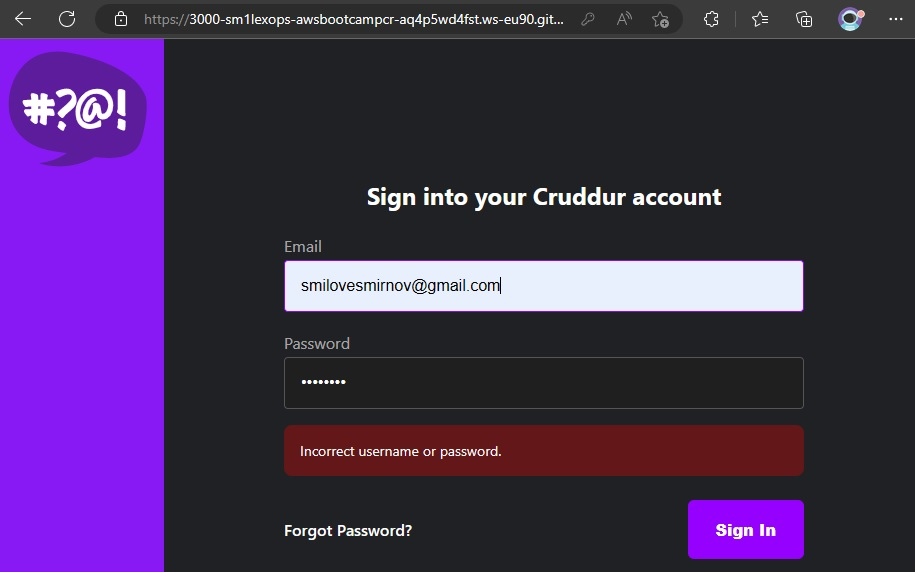
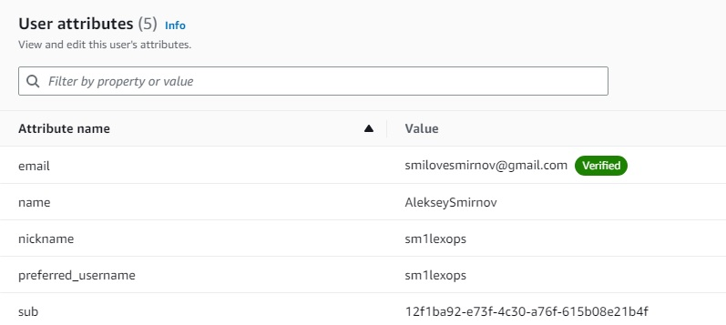
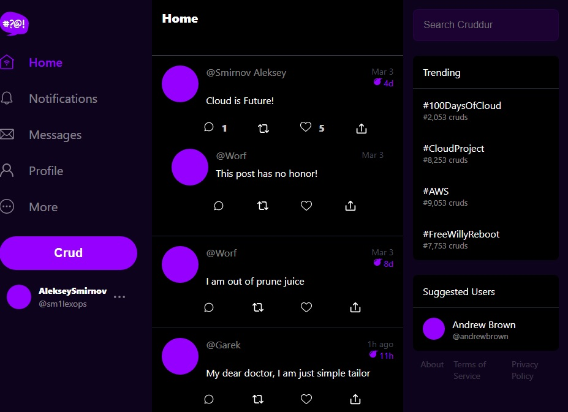
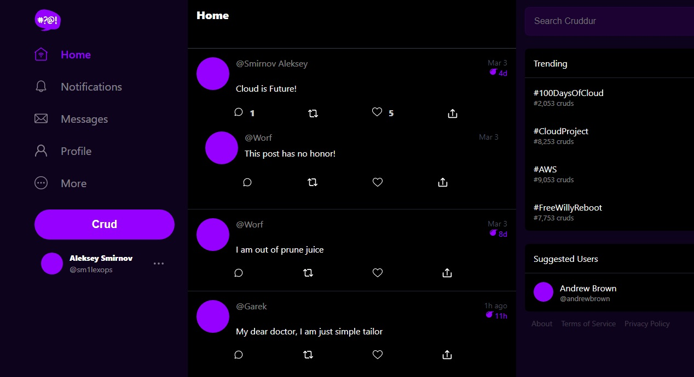
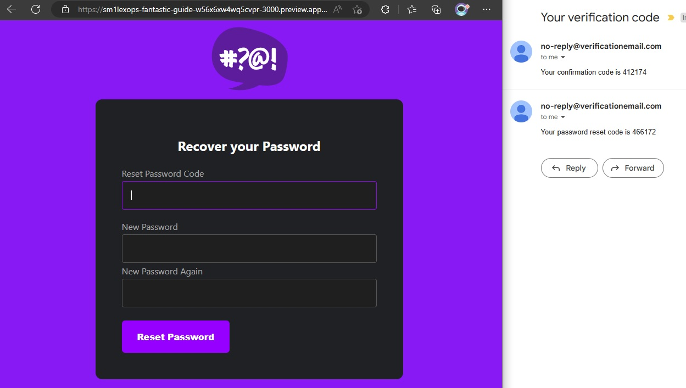

# Week 3 — Decentralized Authentication

## Implement AWS Amplify

```sh
npm i aws-amplify --save
```

> Create AWS Cognito User Pool


## Configure AWS Amplify

> Configure our AWS Cognito pool to `App.js` code

```sh
import { Amplify } from 'aws-amplify';

Amplify.configure({
  "AWS_PROJECT_REGION": process.env.REACT_AWS_PROJECT_REGION,
  "aws_cognito_region": process.env.REACT_APP_AWS_COGNITO_REGION,
  "aws_user_pools_id": process.env.REACT_APP_AWS_USER_POOLS_ID,
  "aws_user_pools_web_client_id": process.env.REACT_APP_CLIENT_ID,
  "oauth": {},
  Auth: {
    // We are not using an Identity Pool
    // identityPoolId: process.env.REACT_APP_IDENTITY_POOL_ID, // REQUIRED - Amazon Cognito Identity Pool ID
    region: process.env.REACT_AWS_PROJECT_REGION,           // REQUIRED - Amazon Cognito Region
    userPoolId: process.env.REACT_APP_AWS_USER_POOLS_ID,         // OPTIONAL - Amazon Cognito User Pool ID
    userPoolWebClientId: process.env.REACT_APP_AWS_USER_POOLS_WEB_CLIENT_ID,   // OPTIONAL - Amazon Cognito Web Client ID (26-char alphanumeric string)
  }
});
```

Conditionally show components based on logged in or logged out

## Update `HomeFeedPage.js`

```sh
import { Auth } from 'aws-amplify';

// set a state
const [user, setUser] = React.useState(null);

// check if we are authenicated
const checkAuth = async () => {
  Auth.currentAuthenticatedUser({
    // Optional, By default is false. 
    // If set to true, this call will send a 
    // request to Cognito to get the latest user data
    bypassCache: false 
  })
  .then((user) => {
    console.log('user',user);
    return Auth.currentAuthenticatedUser()
  }).then((cognito_user) => {
      setUser({
        display_name: cognito_user.attributes.name,
        handle: cognito_user.attributes.preferred_username
      })
  })
  .catch((err) => console.log(err));
};
```

> Check all ENV VAR

```sh
      REACT_APP_AWS_PROJECT_REGION: "${AWS_DEFAULT_REGION}"
      REACT_APP_AWS_COGNITO_REGION: "${AWS_DEFAULT_REGION}"
      REACT_APP_AWS_USER_POOLS_ID: "<your-central-region>"
      REACT_APP_CLIENT_ID: "<your id>"
```

`userPoolWebClientId` ENV need to be same as the `aws_user_pools_web_client_id`

## Update `./frontend-react-js/src/components/ProfileInfo.js`

```sh
import { Auth } from 'aws-amplify';

const signOut = async () => {
  try {
      await Auth.signOut({ global: true });
      window.location.href = "/"
  } catch (error) {
      console.log('error signing out: ', error);
  }
}
```

## Update `DesktopSidebar.js` for showing components if you are logged or not

```sh
  let trending;
  let suggested;
  let join;
  if (props.user) {
    trending = <TrendingSection trendings={trendings} />
    suggested = <SuggestedUsersSection users={users} />
  } else {
    join = <JoinSection />
  }
```

## Update `SigninPage.js` for authorizations with aws-amplify

```sh
  const onsubmit = async (event) => {
    setErrors('')
    event.preventDefault();
    Auth.signIn(email, password)
    .then(user => {
      console.log('user',user)
      localStorage.setItem("access_token", user.signInUserSession.accessToken.jwtToken)
      window.location.href = "/"
    })
    .catch(error => { 
      if (error.code == 'UserNotConfirmedException') {
        window.location.href = "/confirm"
      }
      setErrors(error.message)
    });
    return false
  }
```

> If all Correct, Up your `compose-docker.yml`, and login with user wich you create in AWS Cognito



> For bypassing jwttoken for authorization users, and the need to change password, send to AWS command

```sh
aws cognito-idp admin-set-user-password \
> --user-pool-id eu-central-1_voJ0qpCh7 \
> --username <your_mail> \
> --password <your_password> \
> --permanent
```

> For correct display loggin user, set user attributes in Cognito   



After that you should get authorized, and see your name in the left lower corner



## Update `SignupPage.js`

```js
  const onsubmit = async (event) => {
    event.preventDefault();
    setErrors('')
    console.log('username',username)
    console.log('email',email)
    console.log('name',name)
    try {
      const { user } = await Auth.signUp({
        username: email,
        password: password,
        attributes: {
          name: name,
          email: email,
          preferred_username: username,
        },
        autoSignIn: { // optional - enables auto sign in after user is confirmed
          enabled: true,
        }
      });
      console.log(user);
      window.location.href = `/confirm?email=${email}`
    } catch (error) {
        console.log(error);
        setErrors(error.message)
    }
    return false
  }
```

## Update `ConfirmationPage.js`

```js
import { Auth } from 'aws-amplify';

  const resend_code = async (event) => {
    setErrors('')
    try {
      await Auth.resendSignUp(email);
      console.log('code resent successfully');
      setCodeSent(true)
    } catch (err) {
      // does not return a code
      // does cognito always return english
      // for this to be an okay match?
      console.log(err)
      if (err.message == 'Username cannot be empty'){
        setCognitoErrors("You need to provide an email in order to send Resend Activiation Code")   
      } else if (err.message == "Username/client id combination not found."){
        setCognitoErrors("Email is invalid or cannot be found.")   
      }
    }
  }

  const onsubmit = async (event) => {
    event.preventDefault();
    setErrors('')
    try {
      await Auth.confirmSignUp(email, code);
      window.location.href = "/"
    } catch (error) {
      setErrors(error.message)
    }
    return false
  }
```

> After All you should can SignIn


>  and SignUp



## Update `RecoveryPage.js`

```js
import { Auth } from 'aws-amplify';

const onsubmit_send_code = async (event) => {
  event.preventDefault();
  setErrors('')
  Auth.forgotPassword(username)
  .then((data) => setFormState('confirm_code') )
  .catch((err) => setErrors(err.message) );
  return false
}

const onsubmit_confirm_code = async (event) => {
  event.preventDefault();
  setErrors('')
  if (password == passwordAgain){
    Auth.forgotPasswordSubmit(username, code, password)
    .then((data) => setFormState('success'))
    .catch((err) => setErrors(err.message) );
  } else {
    setErrors('Passwords do not match')
  }
  return false
}
```

Check that you should can recovery your password



## Authenticating Server Side

Add in the `HomeFeedPage.js` a header eto pass along the access token

```js
  headers: {
    Authorization: `Bearer ${localStorage.getItem("access_token")}`
  }
```

Update `App.py`

```sh
cors = CORS(
  app, 
  resources={r"/api/*": {"origins": origins}},
  headers=['Content-Type', 'Authorization'], 
  expose_headers='Authorization',
  methods="OPTIONS,GET,HEAD,POST"
)
```

## Homework Challenges

*In Progress*
