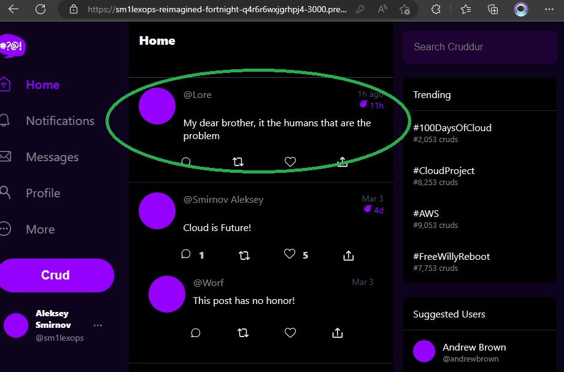
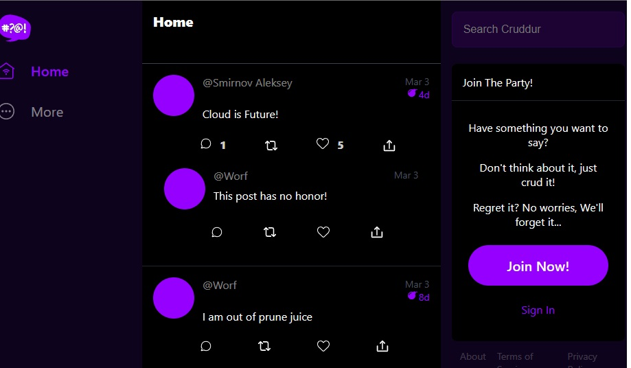

# Week 3 — Decentralized Authentication

## Implement AWS Amplify

```sh
npm i aws-amplify --save
```

> Create AWS Cognito User Pool


## Configure AWS Amplify

> Configure our AWS Cognito pool to `App.js` code

```sh
import { Amplify } from 'aws-amplify';

Amplify.configure({
  "AWS_PROJECT_REGION": process.env.REACT_AWS_PROJECT_REGION,
  "aws_cognito_region": process.env.REACT_APP_AWS_COGNITO_REGION,
  "aws_user_pools_id": process.env.REACT_APP_AWS_USER_POOLS_ID,
  "aws_user_pools_web_client_id": process.env.REACT_APP_CLIENT_ID,
  "oauth": {},
  Auth: {
    // We are not using an Identity Pool
    // identityPoolId: process.env.REACT_APP_IDENTITY_POOL_ID, // REQUIRED - Amazon Cognito Identity Pool ID
    region: process.env.REACT_AWS_PROJECT_REGION,           // REQUIRED - Amazon Cognito Region
    userPoolId: process.env.REACT_APP_AWS_USER_POOLS_ID,         // OPTIONAL - Amazon Cognito User Pool ID
    userPoolWebClientId: process.env.REACT_APP_AWS_USER_POOLS_WEB_CLIENT_ID,   // OPTIONAL - Amazon Cognito Web Client ID (26-char alphanumeric string)
  }
});
```

Conditionally show components based on logged in or logged out

## Update `HomeFeedPage.js`

```sh
import { Auth } from 'aws-amplify';

// set a state
const [user, setUser] = React.useState(null);

// check if we are authenicated
const checkAuth = async () => {
  Auth.currentAuthenticatedUser({
    // Optional, By default is false. 
    // If set to true, this call will send a 
    // request to Cognito to get the latest user data
    bypassCache: false 
  })
  .then((user) => {
    console.log('user',user);
    return Auth.currentAuthenticatedUser()
  }).then((cognito_user) => {
      setUser({
        display_name: cognito_user.attributes.name,
        handle: cognito_user.attributes.preferred_username
      })
  })
  .catch((err) => console.log(err));
};
```

> Check all ENV VAR

```sh
      REACT_APP_AWS_PROJECT_REGION: "${AWS_DEFAULT_REGION}"
      REACT_APP_AWS_COGNITO_REGION: "${AWS_DEFAULT_REGION}"
      REACT_APP_AWS_USER_POOLS_ID: "<your-central-region>"
      REACT_APP_CLIENT_ID: "<your id>"
```

`userPoolWebClientId` ENV need to be same as the `aws_user_pools_web_client_id`

## Update `./frontend-react-js/src/components/ProfileInfo.js`

```sh
import { Auth } from 'aws-amplify';

const signOut = async () => {
  try {
      await Auth.signOut({ global: true });
      window.location.href = "/"
  } catch (error) {
      console.log('error signing out: ', error);
  }
}
```

## Update `DesktopSidebar.js` for showing components if you are logged or not

```sh
  let trending;
  let suggested;
  let join;
  if (props.user) {
    trending = <TrendingSection trendings={trendings} />
    suggested = <SuggestedUsersSection users={users} />
  } else {
    join = <JoinSection />
  }
```

## Update `SigninPage.js` for authorizations with aws-amplify

```sh
  const onsubmit = async (event) => {
    setErrors('')
    event.preventDefault();
    Auth.signIn(email, password)
    .then(user => {
      console.log('user',user)
      localStorage.setItem("access_token", user.signInUserSession.accessToken.jwtToken)
      window.location.href = "/"
    })
    .catch(error => { 
      if (error.code == 'UserNotConfirmedException') {
        window.location.href = "/confirm"
      }
      setErrors(error.message)
    });
    return false
  }
```

> If all Correct, Up your `compose-docker.yml`, and login with user wich you create in AWS Cognito


> For bypassing jwttoken for authorization users, and the need to change password, send to AWS command

```sh
aws cognito-idp admin-set-user-password \
> --user-pool-id eu-central-1_voJ0qpCh7 \
> --username <your_mail> \
> --password <your_password> \
> --permanent
```

> For correct display loggin user, set user attributes in Cognito   


After that you should get authorized, and see your name in the left lower corner


## Update `SignupPage.js`

```js
  const onsubmit = async (event) => {
    event.preventDefault();
    setErrors('')
    console.log('username',username)
    console.log('email',email)
    console.log('name',name)
    try {
      const { user } = await Auth.signUp({
        username: email,
        password: password,
        attributes: {
          name: name,
          email: email,
          preferred_username: username,
        },
        autoSignIn: { // optional - enables auto sign in after user is confirmed
          enabled: true,
        }
      });
      console.log(user);
      window.location.href = `/confirm?email=${email}`
    } catch (error) {
        console.log(error);
        setErrors(error.message)
    }
    return false
  }
```

## Update `ConfirmationPage.js`

```js
import { Auth } from 'aws-amplify';

  const resend_code = async (event) => {
    setErrors('')
    try {
      await Auth.resendSignUp(email);
      console.log('code resent successfully');
      setCodeSent(true)
    } catch (err) {
      // does not return a code
      // does cognito always return english
      // for this to be an okay match?
      console.log(err)
      if (err.message == 'Username cannot be empty'){
        setCognitoErrors("You need to provide an email in order to send Resend Activiation Code")   
      } else if (err.message == "Username/client id combination not found."){
        setCognitoErrors("Email is invalid or cannot be found.")   
      }
    }
  }

  const onsubmit = async (event) => {
    event.preventDefault();
    setErrors('')
    try {
      await Auth.confirmSignUp(email, code);
      window.location.href = "/"
    } catch (error) {
      setErrors(error.message)
    }
    return false
  }
```

> After All you should can SignIn and SignUp with `Your email confirmation code`


## Update `RecoveryPage.js`

```js
import { Auth } from 'aws-amplify';

const onsubmit_send_code = async (event) => {
  event.preventDefault();
  setErrors('')
  Auth.forgotPassword(username)
  .then((data) => setFormState('confirm_code') )
  .catch((err) => setErrors(err.message) );
  return false
}

const onsubmit_confirm_code = async (event) => {
  event.preventDefault();
  setErrors('')
  if (password == passwordAgain){
    Auth.forgotPasswordSubmit(username, code, password)
    .then((data) => setFormState('success'))
    .catch((err) => setErrors(err.message) );
  } else {
    setErrors('Passwords do not match')
  }
  return false
}
```

Make sure you have received a recovery code to reset your password


## Authenticating Server Side

Add in the `HomeFeedPage.js` a header passing along the access token

```js
  headers: {
    Authorization: `Bearer ${localStorage.getItem("access_token")}`
  }
```

### Update `App.py`

> add library for JWT Token

```sh
import sys

from lib.cognito_jwt_token import CognitoJwtToken, extract_access_token, TokenVerifyError
```

### Update CORS, add headers

```py
cors = CORS(
  app, 
  resources={r"/api/*": {"origins": origins}},
  headers=['Content-Type', 'Authorization'], 
  expose_headers='Authorization',
  methods="OPTIONS,GET,HEAD,POST"
)
```

> add cognito env var for token

```py
cognito_jwt_token = CognitoJwtToken(
  user_pool_id=os.getenv("AWS_COGNITO_USER_POOL_ID"), 
  user_pool_client_id=os.getenv("AWS_COGNITO_USER_POOL_CLIENT_ID"),
  region=os.getenv("AWS_DEFAULT_REGION")
)
```

### Update `@app.route("/api/activities/home", methods=['GET'])`

```py
@app.route("/api/activities/home", methods=['GET'])
@xray_recorder.capture('activities_home')
def data_home():
  access_token = extract_access_token(request.headers)
  try:
    claims = cognito_jwt_token.verify(access_token)
    # authenicatied request
    app.logger.debug("authenticated")
    app.logger.debug(claims)
    app.logger.debug(claims['username'])
    data = HomeActivities.run(cognito_user_id=claims['username'])
  except TokenVerifyError as e:
    # unauthenicatied request
    app.logger.debug(e)
    app.logger.debug("unauthenicated")
    data = HomeActivities.run()
  return data, 200
```

Add to `requirements.txt`

```sh
Flask-AWSCognito
```

> Add ENV VAR to backend docker-compose

```sh
      AWS_COGNITO_USER_POOL_ID: "<your-region>"
      AWS_COGNITO_USER_POOL_CLIENT_ID: "<your-client-id>"   
```

### Add new file for token service `./backend-flask/lib/cognito_jwt_token.py` 

```py
import time
import requests
from jose import jwk, jwt
from jose.exceptions import JOSEError
from jose.utils import base64url_decode

class FlaskAWSCognitoError(Exception):
  pass

class TokenVerifyError(Exception):
  pass

def extract_access_token(request_headers):
    access_token = None
    auth_header = request_headers.get("Authorization")
    if auth_header and " " in auth_header:
        _, access_token = auth_header.split()
    return access_token

class CognitoJwtToken:
    def __init__(self, user_pool_id, user_pool_client_id, region, request_client=None):
        self.region = region
        if not self.region:
            raise FlaskAWSCognitoError("No AWS region provided")
        self.user_pool_id = user_pool_id
        self.user_pool_client_id = user_pool_client_id
        self.claims = None
        if not request_client:
            self.request_client = requests.get
        else:
            self.request_client = request_client
        self._load_jwk_keys()


    def _load_jwk_keys(self):
        keys_url = f"https://cognito-idp.{self.region}.amazonaws.com/{self.user_pool_id}/.well-known/jwks.json"
        try:
            response = self.request_client(keys_url)
            self.jwk_keys = response.json()["keys"]
        except requests.exceptions.RequestException as e:
            raise FlaskAWSCognitoError(str(e)) from e

    @staticmethod
    def _extract_headers(token):
        try:
            headers = jwt.get_unverified_headers(token)
            return headers
        except JOSEError as e:
            raise TokenVerifyError(str(e)) from e

    def _find_pkey(self, headers):
        kid = headers["kid"]
        # search for the kid in the downloaded public keys
        key_index = -1
        for i in range(len(self.jwk_keys)):
            if kid == self.jwk_keys[i]["kid"]:
                key_index = i
                break
        if key_index == -1:
            raise TokenVerifyError("Public key not found in jwks.json")
        return self.jwk_keys[key_index]

    @staticmethod
    def _verify_signature(token, pkey_data):
        try:
            # construct the public key
            public_key = jwk.construct(pkey_data)
        except JOSEError as e:
            raise TokenVerifyError(str(e)) from e
        # get the last two sections of the token,
        # message and signature (encoded in base64)
        message, encoded_signature = str(token).rsplit(".", 1)
        # decode the signature
        decoded_signature = base64url_decode(encoded_signature.encode("utf-8"))
        # verify the signature
        if not public_key.verify(message.encode("utf8"), decoded_signature):
            raise TokenVerifyError("Signature verification failed")

    @staticmethod
    def _extract_claims(token):
        try:
            claims = jwt.get_unverified_claims(token)
            return claims
        except JOSEError as e:
            raise TokenVerifyError(str(e)) from e

    @staticmethod
    def _check_expiration(claims, current_time):
        if not current_time:
            current_time = time.time()
        if current_time > claims["exp"]:
            raise TokenVerifyError("Token is expired")  # probably another exception

    def _check_audience(self, claims):
        # and the Audience  (use claims['client_id'] if verifying an access token)
        audience = claims["aud"] if "aud" in claims else claims["client_id"]
        if audience != self.user_pool_client_id:
            raise TokenVerifyError("Token was not issued for this audience")

    def verify(self, token, current_time=None):
        """ https://github.com/awslabs/aws-support-tools/blob/master/Cognito/decode-verify-jwt/decode-verify-jwt.py """
        if not token:
            raise TokenVerifyError("No token provided")

        headers = self._extract_headers(token)
        pkey_data = self._find_pkey(headers)
        self._verify_signature(token, pkey_data)

        claims = self._extract_claims(token)
        self._check_expiration(claims, current_time)
        self._check_audience(claims)

        self.claims = claims 
        return claims
```

### Update `backend-flask/services/home_activities.py`

```py
def run(cognito_user_id=None):
  ...
  # and this to the end of the file before results return
      if cognito_user_id != None:
        extra_crud = {
          'uuid': '248959df-3079-4947-b847-9e0892d1bab4',
          'handle':  'Lore',
          'message': 'My dear brother, it the humans that are the problem',
          'created_at': (now - timedelta(hours=1)).isoformat(),
          'expires_at': (now + timedelta(hours=12)).isoformat(),
          'likes': 1042,
          'replies': []
        }
        results.insert(0,extra_crud)
```

### Update `frontend-react-js/src/components/ProfileInfo.js` for remove token after exiting the app

```py
    try {
        await Auth.signOut({ global: true });
        window.location.href = "/"
        localStorage.removeItem("access_token")
    } catch (error) {
        console.log('error signing out: ', error);
    }localStorage.removeItem("access_token")
```

> Up `docker-compose.yml` *install before npm i* check for ENV

After all in backend-flask container logs you should see success authentication

```sh
172.18.0.1 - - [15/Mar/2023 11:19:17] "OPTIONS /api/activities/home HTTP/1.1" 200 -
[2023-03-15 11:19:17,448] DEBUG in app: authenicated
[2023-03-15 11:19:17,449] DEBUG in app: {'sub': 'cdf7c5fe-2d1d-4a19-b3d6-f9af1600e599', 'iss': 'https://cognito-idp.eu-central-1.amazonaws.com/eu-central-1_SNp3X0CQ4', 'client_id': '7s4fa15do7dfgd1m9fdhhv26p5', 'origin_jti': 'f6e17bfa-b382-43f3-af85-46eabd2587bd', 'event_id': '9f7e434e-8a46-4787-9a4b-ddaec6c93438', 'token_use': 'access', 'scope': 'aws.cognito.signin.user.admin', 'auth_time': 1678879156, 'exp': 1678882756, 'iat': 1678879156, 'jti': 'b488aef6-b4f5-4a08-b085-d0fb357d4689', 'username': 'cdf7c5fe-2d1d-4a19-b3d6-f9af1600e599'}
[2023-03-15 11:19:17,449] DEBUG in app: cdf7c5fe-2d1d-4a19-b3d6-f9af1600e599
```
If you signin you should see `@Lore` message



> Logout


## Homework Challenges

*In Progress*
