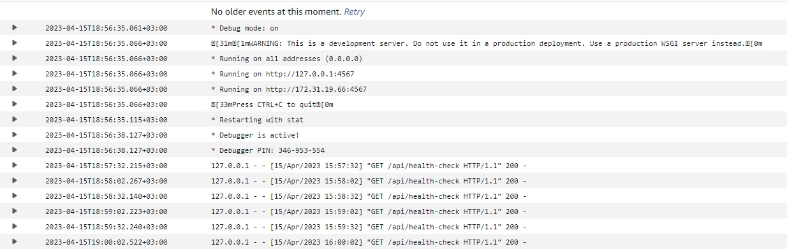
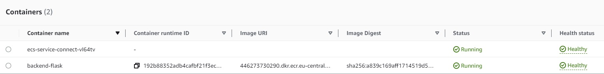
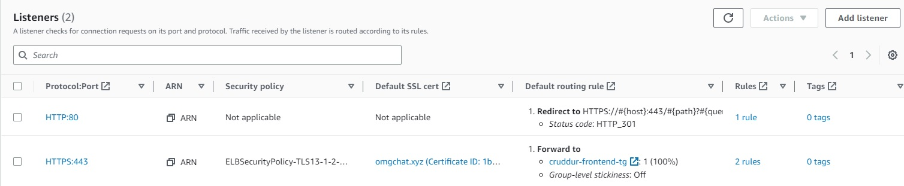
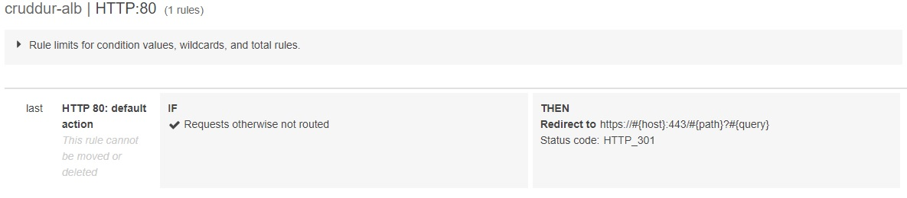
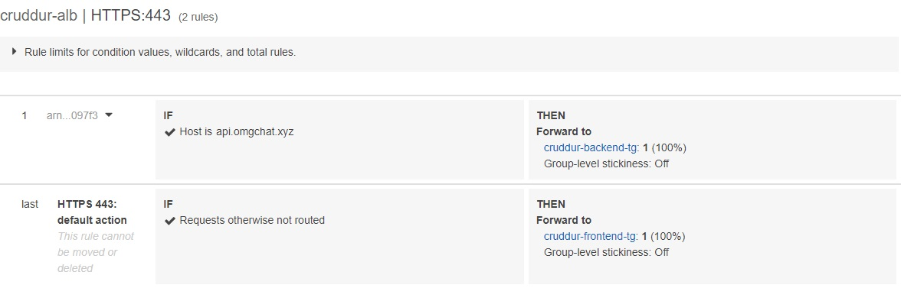
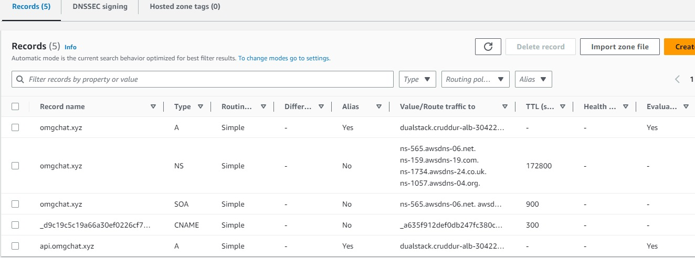
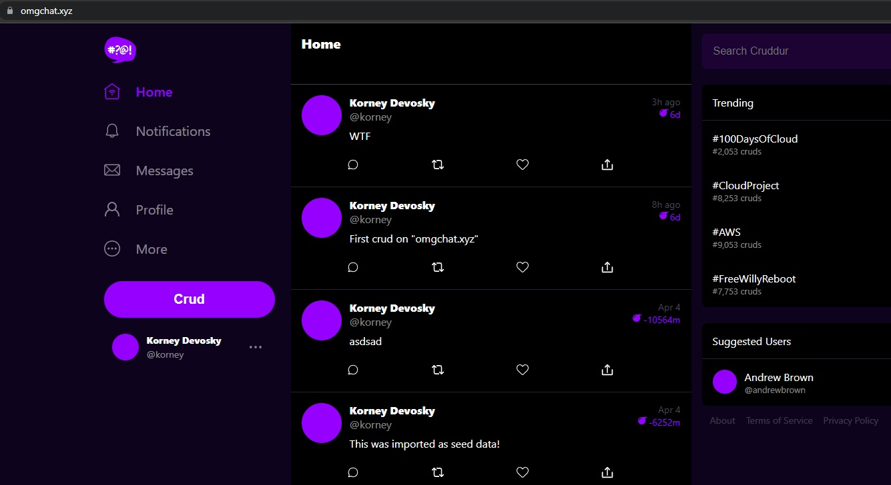

# Week 6 — Deploying Containers

*begin*

## Prerequisites

* Create file for testing backend health

```py
#!/usr/bin/env python3

import urllib.request

try:
  response = urllib.request.urlopen('http://localhost:4567/api/health-check')
  if response.getcode() == 200:
    print("[OK] Flask server is running")
    exit(0) # success
  else:
    print("[BAD] Flask server is not running")
    exit(1) # false
# This for some reason is not capturing the error....
#except ConnectionRefusedError as e:
# so we'll just catch on all even though this is a bad practice
except Exception as e:
  print(e)
  exit(1) # false
```

> `chmod u+x ./bin/health-check` run `./bin/health-check` and you should get

```sh
<urlopen error [Errno 111] Connection refused>
```

## Passing Secrets to AWS Parametere Store

> Create AWS parameter store for ENV VAR

```sh
aws ssm put-parameter --type "SecureString" --name "/cruddur/backend-flask/AWS_ACCESS_KEY_ID" --value $AWS_ACCESS_KEY_ID
aws ssm put-parameter --type "SecureString" --name "/cruddur/backend-flask/AWS_SECRET_ACCESS_KEY" --value $AWS_SECRET_ACCESS_KEY
aws ssm put-parameter --type "SecureString" --name "/cruddur/backend-flask/CONNECTION_URL" --value $CONNECTION_PSQL_PROD
aws ssm put-parameter --type "SecureString" --name "/cruddur/backend-flask/ROLLBAR_ACCESS_TOKEN" --value $ROLLBAR_ACCESS_TOKEN
aws ssm put-parameter --type "SecureString" --name "/cruddur/backend-flask/OTEL_EXPORTER_OTLP_HEADERS" --value "x-honeycomb-team=$HONEYCOMB_API_KEY"
```

## Create CloudWatch Log Group, ECS Cluster and Repository

* Export and remember AWS env vars in the gitpod workspace:

```sh
export ECR_PYTHON_URL="$AWS_ACCOUNT_ID.dkr.ecr.$AWS_DEFAULT_REGION.amazonaws.com/cruddur-python"
gp env ECR_PYTHON_URL="$AWS_ACCOUNT_ID.dkr.ecr.$AWS_DEFAULT_REGION.amazonaws.com/cruddur-python"

export ECR_FRONTEND_REACT_URL="$AWS_ACCOUNT_ID.dkr.ecr.$AWS_DEFAULT_REGION.amazonaws.com/frontend-react-js"
gp env ECR_FRONTEND_REACT_URL="$AWS_ACCOUNT_ID.dkr.ecr.$AWS_DEFAULT_REGION.amazonaws.com/frontend-react-js"

export ECR_BACKEND_FLASK_URL="$AWS_ACCOUNT_ID.dkr.ecr.$AWS_DEFAULT_REGION.amazonaws.com/backend-flask"
gp env ECR_BACKEND_FLASK_URL="$AWS_ACCOUNT_ID.dkr.ecr.$AWS_DEFAULT_REGION.amazonaws.com/backend-flask"
```

* Create Log Group

```sh
aws logs create-log-group --log-group-name /cruddur/fargate-cluster
aws logs put-retention-policy --log-group-name /cruddur/fargate-cluster --retention-in-days 1
```

* Using AWS CLI create ECS cluster named `cruddur`, and three ECR repos on AWS:

```sh
aws ecs create-cluster \
 --cluster-name cruddur \
 --service-connect-defaults namespace=cruddur

aws ecr create-repository \
 --repository-name cruddur-python \
 --image-tag-mutability MUTABLE

aws ecr create-repository \
 --repository-name backend-flask \
 --image-tag-mutability MUTABLE

aws ecr create-repository \
 --repository-name frontend-react-js \
 --image-tag-mutability MUTABLE
```
 
## Build and Push to ECR backend/frontend images


> Should get success json answer


## Push Python base-image

* First Retrieve an authentication token and authenticate your Docker client to your registry.

> Use the AWS CLI:

```sh
aws ecr get-login-password --region $AWS_DEFAULT_REGION | docker login --username AWS --password-stdin "$AWS_ACCOUNT_ID.dkr.ecr.$AWS_DEFAULT_REGION.amazonaws.com"
```

> Check you are in `./backend-flask` repository

```sh
docker pull python:3.10-slim-buster
```

* After the pull completes, tag your image so you can push the image to this repository:

```sh
docker tag python:3.10-slim-buster $ECR_PYTHON_URL:3.10-slim-buster
```

* Run the following command to push this image to your newly created AWS repository:

```sh
docker push $ECR_PYTHON_URL:3.10-slim-buster
```
    
> You should get your image at ECR 


## Build and Push backend-flask image

```sh
docker build -t backend-flask .
```

```sh
docker tag backend-flask:latest $ECR_BACKEND_FLASK_URL:latest
```

```sh
docker push $ECR_BACKEND_FLASK_URL:latest
```

## Build and Push frontend-react-js image

## Create ECS Image For frontend React

> Check you are in `./frontend-react-js` repository, change ENV to yours

```sh
docker build \
--build-arg REACT_APP_BACKEND_URL="https://api.omgchat.xyz" \
--build-arg REACT_APP_AWS_PROJECT_REGION="$AWS_DEFAULT_REGION" \
--build-arg REACT_APP_AWS_COGNITO_REGION="$AWS_DEFAULT_REGION" \
--build-arg REACT_APP_AWS_USER_POOLS_ID="${AWS_COGNITO_USER_POOL_ID}" \
--build-arg REACT_APP_CLIENT_ID="${REACT_APP_CLIENT_ID}" \
-t frontend-react-js \
-f Dockerfile.prod .
```

```sh
docker tag frontend-react-js:latest $ECR_FRONTEND_REACT_URL:latest
```

```sh
docker push $ECR_FRONTEND_REACT_URL:latest
```

* Check in AWS Console ECR your images

## AWS Roles and Security Groups

* Create execution-policy files

> ecs-assume-role-execution-policy.json

```sh
{
  "Version":"2012-10-17",
  "Statement":[{
      "Action":["sts:AssumeRole"],
      "Effect":"Allow",
      "Principal":{
        "Service":["ecs-tasks.amazonaws.com"]
    }}]
}
```

> ecs-service-execution-policy.json

```sh
{
  "Version": "2012-10-17",
  "Statement": [
      {
          "Effect": "Allow",
          "Action": [
              "ecr:GetAuthorizationToken",
              "ecr:BatchCheckLayerAvailability",
              "ecr:GetDownloadUrlForLayer",
              "ecr:BatchGetImage",
              "logs:CreateLogStream",
              "logs:PutLogEvents"
          ],
          "Resource": "*"
      },
      {
          "Effect": "Allow",
          "Action": [
              "ssm:GetParameters",
              "ssm:GetParameter"
          ],
          "Resource": "arn:aws:ssm:eu-central-1:446273730290:parameter/cruddur/backend-flask/*"
      }
  ]
}
```

* Create `CruddurServiceExecutionRole` and Attach Policy

```sh
aws iam create-role \
  --role-name CruddurServiceExecutionRole \
  --assume-role-policy-document file://aws/policies/ecs-assume-role-execution-policy.json

aws iam put-role-policy \
  --policy-name CruddurServiceExecutionPolicy \
  --role-name CruddurServiceExecutionRole \
  --policy-document file://aws/policies/ecs-service-execution-policy.json

aws iam attach-role-policy \
--policy-arn arn:aws:iam::aws:policy/CloudWatchFullAccess \
--role-name CruddurServiceExecutionRole
```

* Create the TaskRole `CruddurTaskRole` and attach policies:

```sh
aws iam create-role \
    --role-name CruddurTaskRole \
    --assume-role-policy-document "{
  \"Version\":\"2012-10-17\",
  \"Statement\":[{
    \"Action\":[\"sts:AssumeRole\"],
    \"Effect\":\"Allow\",
    \"Principal\":{
      \"Service\":[\"ecs-tasks.amazonaws.com\"]
    }
  }]
}"

aws iam put-role-policy \
  --policy-name SSMAccessPolicy \
  --role-name CruddurTaskRole \
  --policy-document "{
  \"Version\":\"2012-10-17\",
  \"Statement\":[{
    \"Action\":[
      \"ssmmessages:CreateControlChannel\",
      \"ssmmessages:CreateDataChannel\",
      \"ssmmessages:OpenControlChannel\",
      \"ssmmessages:OpenDataChannel\"
    ],
    \"Effect\":\"Allow\",
    \"Resource\":\"*\"
  }]
}"

aws iam attach-role-policy \
  --policy-arn arn:aws:iam::aws:policy/CloudWatchFullAccess \
  --role-name CruddurTaskRole

aws iam attach-role-policy \
  --policy-arn arn:aws:iam::aws:policy/AWSXRayDaemonWriteAccess \
  --role-name CruddurTaskRole
```

## Create Tasks and Services definitions for ECS

* Create `./aws/task-definitions/backend-flask.json` file, change your AWS Region and ID

> Next Fields ENV `value` for testing connections you can change to "*"

```json
{"name": "FRONTEND_URL", "value": "https://omgchat.xyz"},
{"name": "BACKEND_URL", "value": "https://api.omgchat.xyz"},
```

```json
{
  "family": "backend-flask",
  "executionRoleArn": "arn:aws:iam::446273730290:role/CruddurServiceExecutionRole",
  "taskRoleArn": "arn:aws:iam::446273730290:role/CruddurTaskRole",
  "networkMode": "awsvpc",
  "cpu": "256",
  "memory": "512",
  "requiresCompatibilities": [ 
    "FARGATE" 
  ],
  "containerDefinitions": [
    {
      "name": "backend-flask",
      "image": "446273730290.dkr.ecr.eu-central-1.amazonaws.com/backend-flask",
      "cpu": 256,
      "memory": 512,
      "essential": true,
      "healthCheck": {
        "command": [
          "CMD-SHELL",
          "python /backend-flask/bin/health-check"
        ],
        "interval": 30,
        "timeout": 5,
        "retries": 3,
        "startPeriod": 60
      },
      "portMappings": [
        {
          "name": "backend-flask",
          "containerPort": 4567,
          "protocol": "tcp", 
          "appProtocol": "http"
        }
      ],
      "logConfiguration": {
        "logDriver": "awslogs",
        "options": {
            "awslogs-group": "cruddur",
            "awslogs-region": "eu-central-1",
            "awslogs-stream-prefix": "backend-flask"
        }
      },
      "environment": [
        {"name": "OTEL_SERVICE_NAME", "value": "backend-flask"},
        {"name": "OTEL_EXPORTER_OTLP_ENDPOINT", "value": "https://api.honeycomb.io"},
        {"name": "AWS_COGNITO_USER_POOL_ID", "value": "eu-central-1_LUcicGf0b"},
        {"name": "AWS_COGNITO_USER_POOL_CLIENT_ID", "value": "6ka89qsm260qt7859q6enn93nq"},
        {"name": "FRONTEND_URL", "value": "https://omgchat.xyz"},
        {"name": "BACKEND_URL", "value": "https://api.omgchat.xyz"},
        {"name": "AWS_DEFAULT_REGION", "value": "eu-central-1"}
      ],
      "secrets": [
        {"name": "AWS_ACCESS_KEY_ID"    , "valueFrom": "arn:aws:ssm:eu-central-1:446273730290:parameter/cruddur/backend-flask/AWS_ACCESS_KEY_ID"},
        {"name": "AWS_SECRET_ACCESS_KEY", "valueFrom": "arn:aws:ssm:eu-central-1:446273730290:parameter/cruddur/backend-flask/AWS_SECRET_ACCESS_KEY"},
        {"name": "CONNECTION_URL"       , "valueFrom": "arn:aws:ssm:eu-central-1:446273730290:parameter/cruddur/backend-flask/CONNECTION_URL" },
        {"name": "AWS_SESSION_TOKEN", "valueFrom": "arn:aws:ssm:eu-central-1:446273730290:parameter/cruddur/backend-flask/AWS_SESSION_TOKEN"},
        {"name": "ROLLBAR_ACCESS_TOKEN" , "valueFrom": "arn:aws:ssm:eu-central-1:446273730290:parameter/cruddur/backend-flask/ROLLBAR_ACCESS_TOKEN" },
        {"name": "OTEL_EXPORTER_OTLP_HEADERS" , "valueFrom": "arn:aws:ssm:eu-central-1:446273730290:parameter/cruddur/backend-flask/OTEL_EXPORTER_OTLP_HEADERS" }
        
      ]
    }
  ]
}
```

* Create `./aws/task-definitions/frontend-react-js.json` file, change your AWS Region and ID

```json
{
    "family": "frontend-react-js",
    "executionRoleArn": "arn:aws:iam::446273730290:role/CruddurServiceExecutionRole",
    "taskRoleArn": "arn:aws:iam::446273730290:role/CruddurTaskRole",
    "networkMode": "awsvpc",
    "cpu": "256",
    "memory": "512",
    "requiresCompatibilities": [ 
      "FARGATE" 
    ],
    "containerDefinitions": [
    {
        "name": "frontend-react-js",
        "image": "446273730290.dkr.ecr.eu-central-1.amazonaws.com/frontend-react-js",
        "essential": true,
        "healthCheck": {
          "command": [
            "CMD-SHELL",
            "curl -f http://localhost:3000 || exit 1"
          ],
          "interval": 30,
          "timeout": 5,
          "retries": 3
        },
        "portMappings": [
          {
            "name": "frontend-react-js",
            "containerPort": 3000,
            "protocol": "tcp", 
            "appProtocol": "http"
          }
        ],
  
        "logConfiguration": {
          "logDriver": "awslogs",
          "options": {
              "awslogs-group": "cruddur",
              "awslogs-region": "eu-central-1",
              "awslogs-stream-prefix": "frontend-react-js"
          }
        }
      }
    ]
  }
```

* Create Services definitions for backend/frontend

> `service-backend-flask.json`, change to yours `securityGroups` and `subnets`, for test you can delete `loadBalancers` field

```json
{
  "cluster": "cruddur",
  "launchType": "FARGATE",
  "desiredCount": 1,
  "enableECSManagedTags": true,
  "enableExecuteCommand": true,
  "loadBalancers": [
    {
        "targetGroupArn": "arn:aws:elasticloadbalancing:eu-central-1:446273730290:targetgroup/cruddur-backend-tg/f442e0139a20b8cb",
        "containerName": "backend-flask",
        "containerPort": 4567
    }
  ],
  "networkConfiguration": {
    "awsvpcConfiguration": {
      "assignPublicIp": "ENABLED",
      "securityGroups": [
        "sg-031232c5e189d8dfa"
      ],
      "subnets": [
        "subnet-07d3623c56679470a",
        "subnet-08601bef1b54cc046",
        "subnet-05823eb7893060c30"
      ]
    }
  },
  "serviceConnectConfiguration": {
    "enabled": true,
    "namespace": "cruddur",
    "services": [
      {
        "portName": "backend-flask",
        "discoveryName": "backend-flask",
        "clientAliases": [{"port": 4567}]
      }
    ]
  },
  "propagateTags": "SERVICE",
  "serviceName": "backend-flask",
  "taskDefinition": "backend-flask"
}
```

> `service-frontend-react-js.json`

```json
{
  "cluster": "cruddur",
  "launchType": "FARGATE",
  "desiredCount": 1,
  "enableECSManagedTags": true,
  "enableExecuteCommand": true,
  "loadBalancers": [
    {
        "targetGroupArn": "arn:aws:elasticloadbalancing:eu-central-1:446273730290:targetgroup/cruddur-frontend-tg/3c6db78fee9cbc5a",
        "containerName": "frontend-react-js",
        "containerPort": 3000
    }
  ],
  "networkConfiguration": {
    "awsvpcConfiguration": {
      "assignPublicIp": "ENABLED",
      "securityGroups": [
        "sg-031232c5e189d8dfa"
      ],
      "subnets": [
        "subnet-07d3623c56679470a",
        "subnet-08601bef1b54cc046",
        "subnet-05823eb7893060c30"
      ]
    }
  },
  "propagateTags": "SERVICE",
  "serviceName": "frontend-react-js",
  "taskDefinition": "frontend-react-js",
  "serviceConnectConfiguration": {
    "enabled": true,
    "namespace": "cruddur",
    "services": [
      {
        "portName": "frontend-react-js",
        "discoveryName": "frontend-react-js",
        "clientAliases": [{"port": 3000}]
      }
    ]
  }
}
```

## Create Security Group for ECS

* Get `DEFAULT_VPC_ID` and `DEFAULT_SUBNET_IDS` in order to create a security group named `crud-srv-sg` that has inbound rules for port 4567 and 3000, and then authorize the security group to gain access of RDS (port 5432 in the default security group):

```sh
export DEFAULT_VPC_ID=$(aws ec2 describe-vpcs \
--filters "Name=isDefault, Values=true" \
--query "Vpcs[0].VpcId" \
--output text)
echo $DEFAULT_VPC_ID

export DEFAULT_SUBNET_IDS=$(aws ec2 describe-subnets  \
 --filters Name=vpc-id,Values=$DEFAULT_VPC_ID \
 --query 'Subnets[*].SubnetId' \
 --output json | jq -r 'join(",")')
echo $DEFAULT_SUBNET_IDS

export CRUD_SERVICE_SG=$(aws ec2 create-security-group \
  --group-name "crud-srv-sg" \
  --description "Security group for Cruddur services on ECS" \
  --vpc-id $DEFAULT_VPC_ID \
  --query "GroupId" --output text)
echo $CRUD_SERVICE_SG

aws ec2 authorize-security-group-ingress \
  --group-id $CRUD_SERVICE_SG \
  --protocol tcp \
  --port 4567 \
  --cidr 0.0.0.0/0

aws ec2 authorize-security-group-ingress \
  --group-id $CRUD_SERVICE_SG \
  --protocol tcp \
  --port 3000 \
  --cidr 0.0.0.0/0

aws ec2 authorize-security-group-ingress \
  --group-id $DB_SG_ID \
  --protocol tcp \
  --port 5432 \
  --source-group $CRUD_SERVICE_SG
```

* Then Create ALB SG `cruddur-alb-group` and give access to port `4567`, `3000` for `crud-srv-sg`, access from `any` to port `80`, `443`

* Create AWS Task and Services, check in the console `HEALTHY` status after few minutes

```sh
aws ecs register-task-definition --cli-input-json file://aws/task-definitions/backend-flask.json

aws ecs register-task-definition --cli-input-json file://aws/task-definitions/frontend-react-js.json
```

* Create Services

```sh
aws ecs create-service --cli-input-json file://aws/json/service-backend-flask.json

aws ecs register-task-definition --cli-input-json file://aws/task-defintions/service-frontend-react-js.json
```


> This is for when we are uing a NetworkMode of awsvpc

```sh
--network-configuration "awsvpcConfiguration={subnets=[$DEFAULT_SUBNET_IDS],securityGroups=[$SERVICE_CRUD_SG],assignPublicIp=ENABLED}"
```

## Test Container Service Connection

> Install AWS Session Manager Plugin for Linux

```sh
curl "https://s3.amazonaws.com/session-manager-downloads/plugin/latest/ubuntu_64bit/session-manager-plugin.deb" -o "session-manager-plugin.deb"
```

```sh
sudo dpkg -i session-manager-plugin.deb
```

> verify installation

```sh
session-manager-plugin
```

> Create `./ecs/backend/connect-to-backend` script and use session manager 

```sh
#! /usr/bin/bash

if [ -z "$1" ]; then
    echo "===== No TASK_ID argument is defined===== "
    echo "===== Run script with example:  ./scripts/backend/connect-to-backend 99b2f8953616495e99545e5a6066fbb5d backend-flask ====="
    exit 1
fi

TASK_ID=$1

if [ -z "$2"]; then
    echo "===== No CONTAINER_NAME argument is defined ====="
    echo "===== Run script with example:  ./scripts/backend/connect-to-backend 99b2f8953616495e99545e5a6066fbb5d backend-flask ====="
    exit 1
fi    

CONTAINER_NAME=$2

echo "TASK_ID: $TASK_ID"
echo "CONTAINER_NAME: $CONTAINER_NAME"

aws ecs execute-command \
--region $AWS_DEFAULT_REGION \
--cluster cruddur \
--task $TASK_ID \
--container $CONTAINER_NAME \
--command "/bin/bash" \
--interactive
```
  
* You should starting session, and connect to your container


> All container running and `healthy`





## Application Load Balancer

Provision and configure Application Load Balancer along with target groups via AWS console:

- Basic configurations: name `cruddur-alb`, Internet-facing, IPv4 address type;
- Network mapping: default VPC, select first three availability zones;



- Security groups: create a new security group named `cruddur-alb-sg`, set inbound rules of HTTP and HTTPS from anywhere, and Custom TCP of 4567 and 3000 from anywhere (set description as TMP1 and TMP2); In addition, edit inbound rules of security group `crud-srv-sg`, instead of anywhere, set port source from `cruddur-alb-sg`, set description of port 4567 as ALBbackend, and port 3000 as ALBfrontend;




- Listeners and routing: HTTP:4567 with a new target group named `cruddur-backend-flask-tg`, select type as IP addresses, set HTTP:4567, set health check as `/api/health-check` with 3 healthy threshold, get its arn to put in `aws/json/service-backend-flask.json`; Add another listener HTTP:3000 with another target group created named `cruddur-frontend-react-js`, don't care about health check, set 3 healthy threshold, get its arn to put in `aws/json/service-frontend-react-js.json`.

## Domain Configuration

I've registered a domain name `omgchat.xyz` for this bootcamp via [porkbun](https://porkbun.com/). We can manage the domain using Route53 via hosted zone, create an SSL certificate via ACM, setup a record set for naked domain to point to frontend-react-js, and setup a record set for api subdomain to point to the backend-flask:

- At Route 53 > Hosted zones, create a new one with the registered domain name and the public type; Copy the values presented in the NS record type, and paste them into the porkbun nameservers (changes to your authoritative nameservers may take up to a couple of hours to propagate worldwide).
- At Certificate Manger, request a public certificate, add domain names of `omgchat.xyz` and `*.omgchat.xyz`, then enter the created certificate and click "Create records in Route 53", finally Route 53 will show two CNAME records.



- At Load Balancers, add a listener to make HTTP:80 redirect to HTTPS:443, and another one to make HTTPS:443 forward to frontend with certificate we created; edit rules for HTTPS:443 to add a new IF which sets Host Header as `api.omgchat.xyz` and sets THEN forward to `cruddur-backend-flask-tg`.
- At Route 53 > Hosted zones > omgchat.xyz, create a record without a record name, set type as "A - Route Traffic to an IPv4 address and some AWS resources", set route traffic as "Alias to Application and Classic Load Balancer" with the right region and load balancer, set routing policy as simple routing; do it again with record name `api.omgchat.xyz`.

> If All is correct and working, you should get access to your App



## Creat Scripts for ECS Fargate

> Create `build`

```sh

```

> Create `deploy`

```sh

```

> Create `connect`

```sh

```
