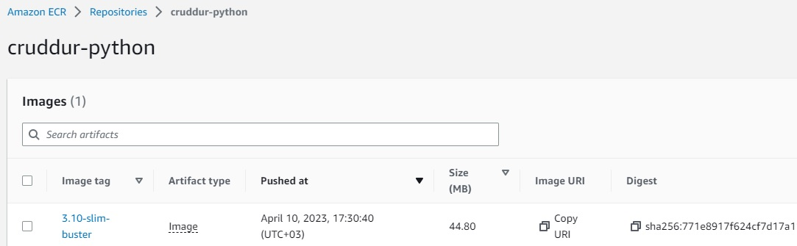
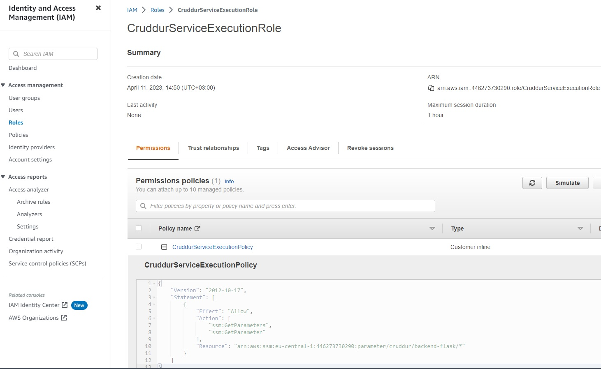

# Week 6 — Deploying Containers

*begin*

## Test RDS Connecetion

* Create file for testing cluster connections

```py
#!/usr/bin/env python3

import urllib.request

try:
  response = urllib.request.urlopen('http://localhost:4567/api/health-check')
  if response.getcode() == 200:
    print("[OK] Flask server is running")
    exit(0) # success
  else:
    print("[BAD] Flask server is not running")
    exit(1) # false
# This for some reason is not capturing the error....
#except ConnectionRefusedError as e:
# so we'll just catch on all even though this is a bad practice
except Exception as e:
  print(e)
  exit(1) # false
```

> `chmod u+x ./bin/health-check` run `./bin/health-check` and you should get

```sh
<urlopen error [Errno 111] Connection refused>
```
## Create CloudWatch Log Group

```sh
aws logs create-log-group --log-group-name /cruddur/fargate-cluster
aws logs put-retention-policy --log-group-name /cruddur/fargate-cluster --retention-in-days 1
```

## Create ECS Cluster

```sh
aws ecs create-cluster \
--cluster-name cruddur \
--service-connect-defaults namespace=cruddur
```

> You should get json answer

## Create ECR repo and push image


> Should get success json answer


## Push your first container

* Create ECR repo

```sh
aws ecr create-repository \
  --repository-name cruddur-python \
  --image-tag-mutability MUTABLE
```

* 1. Retrieve an authentication token and authenticate your Docker client to your registry.
Use the AWS CLI:

```sh
aws ecr get-login-password --region $AWS_DEFAULT_REGION | docker login --username AWS --password-stdin "$AWS_ACCOUNT_ID.dkr.ecr.$AWS_DEFAULT_REGION.amazonaws.com"
```

## For Base-image python

> Set URL for ECR 

```sh
export ECR_PYTHON_URL="$AWS_ACCOUNT_ID.dkr.ecr.$AWS_DEFAULT_REGION.amazonaws.com/cruddur-python"
echo $ECR_PYTHON_URL
```

* 2. Pull your Docker image using the following command. For information on building a Docker file from scratch see the instructions here . You can skip this step if your image is already built:

> Check you are in `./backend-flask` repository

```sh
docker pull python:3.10-slim-buster
```

* 3. After the pull completes, tag your image so you can push the image to this repository:

```sh
docker tag python:3.10-slim-buster $ECR_PYTHON_URL:3.10-slim-buster
```

* 4. Run the following command to push this image to your newly created AWS repository:

```sh
docker push $ECR_PYTHON_URL:3.10-slim-buster
```
    
> You should get your image at ECR 



## For backend-flask

* Create ECR repo

```sh
aws ecr create-repository \
  --repository-name backend-flask \
  --image-tag-mutability MUTABLE
```

> Set URL for ECR 

```sh
export ECR_BACKEND_FLASK_URL="$AWS_ACCOUNT_ID.dkr.ecr.$AWS_DEFAULT_REGION.amazonaws.com/backend-flask"
echo $ECR_BACKEND_FLASK_URL
```

* 2. Build your Docker image using the following command. For information on building a Docker file from scratch see the instructions here . You can skip this step if your image is already built:

> Check you are in `./backend-flask` repository

```sh
docker build -t backend-flask .
```

* 3. After the pull completes, tag your image so you can push the image to this repository:

```sh
docker tag backend-flask:latest $ECR_BACKEND_FLASK_URL:latest
```

* 4. Run the following command to push this image to your newly created AWS repository:

```sh
docker push $ECR_BACKEND_FLASK_URL:latest
```

## Create Exection Role for Task Defintion

> Create file /aws/ecs-assume-role-execution-policy.json` for execution role

```sh
{
  "Version":"2012-10-17",
  "Statement":[{
      "Action":["sts:AssumeRole"],
      "Effect":"Allow",
      "Principal":{
        "Service":["ecs-tasks.amazonaws.com"]
    }}]
}
```

> Create execution role from root worspace directory

```sh
aws iam create-role \
    --role-name CruddurServiceExecutionRole \
    --assume-role-policy-document file://aws/policies/ecs-assume-role-execution-policy.json
```

> Create file `ecs-service-execution-policy.json` with policy [Source Documentation](https://docs.aws.amazon.com/AmazonECS/latest/developerguide/task_execution_IAM_role.html)

```sh
{
    "Version": "2012-10-17",
    "Statement": [
        {
            "Effect": "Allow",
            "Action": [
                "ecr:GetAuthorizationToken",
                "ecr:BatchCheckLayerAvailability",
                "ecr:GetDownloadUrlForLayer",
                "ecr:BatchGetImage",
                "logs:CreateLogStream",
                "logs:PutLogEvents"
            ],
            "Resource": "*"
        },
        {
            "Effect": "Allow",
            "Action": [
                "ssm:GetParameters",
                "ssm:GetParameter"
            ],
            "Resource": "arn:aws:ssm:eu-central-1:446273730290:parameter/cruddur/backend-flask/*"
        }
    ]
}
```

> Put role policy

```sh
aws iam put-role-policy \
  --policy-name CruddurServiceExecutionPolicy \
  --role-name CruddurServiceExecutionRole \
  --policy-document file://aws/policies/ecs-service-execution-policy.json
```

> Check you should get role with policy attached



## Create Task Role for Task Defintion

```sh
aws iam create-role \
    --role-name CruddurTaskRole \
    --assume-role-policy-document "{
  \"Version\":\"2012-10-17\",
  \"Statement\":[{
    \"Action\":[\"sts:AssumeRole\"],
    \"Effect\":\"Allow\",
    \"Principal\":{
      \"Service\":[\"ecs-tasks.amazonaws.com\"]
    }
  }]
}"

aws iam put-role-policy \
  --policy-name SSMAccessPolicy \
  --role-name CruddurTaskRole \
  --policy-document "{
  \"Version\":\"2012-10-17\",
  \"Statement\":[{
    \"Action\":[
      \"ssmmessages:CreateControlChannel\",
      \"ssmmessages:CreateDataChannel\",
      \"ssmmessages:OpenControlChannel\",
      \"ssmmessages:OpenDataChannel\"
    ],
    \"Effect\":\"Allow\",
    \"Resource\":\"*\"
  }]
}
"
```

> Attach policy to role

```sh
aws iam attach-role-policy --policy-arn arn:aws:iam::aws:policy/CloudWatchFullAccess --role-name CruddurTaskRole
aws iam attach-role-policy --policy-arn arn:aws:iam::aws:policy/AWSXRayDaemonWriteAccess --role-name CruddurTaskRole
```


> Create AWS parameter store for ENV VAR

```sh
aws ssm put-parameter --type "SecureString" --name "/cruddur/backend-flask/AWS_ACCESS_KEY_ID" --value $AWS_ACCESS_KEY_ID
aws ssm put-parameter --type "SecureString" --name "/cruddur/backend-flask/AWS_SECRET_ACCESS_KEY" --value $AWS_SECRET_ACCESS_KEY
aws ssm put-parameter --type "SecureString" --name "/cruddur/backend-flask/CONNECTION_URL" --value $CONNECTION_PSQL_PROD
aws ssm put-parameter --type "SecureString" --name "/cruddur/backend-flask/ROLLBAR_ACCESS_TOKEN" --value $ROLLBAR_ACCESS_TOKEN
aws ssm put-parameter --type "SecureString" --name "/cruddur/backend-flask/OTEL_EXPORTER_OTLP_HEADERS" --value "x-honeycomb-team=$HONEYCOMB_API_KEY"
```

* Create `./aws/task-definitions/backend-flask.json` file, change your AWS Region and ID

```json
{
  "family": "backend-flask",
  "executionRoleArn": "arn:aws:iam::446273730290:role/CruddurServiceExecutionRole",
  "taskRoleArn": "arn:aws:iam::446273730290:role/CruddurTaskRole",
  "networkMode": "awsvpc",
  "containerDefinitions": [
    {
      "name": "backend-flask",
      "image": "446273730290.dkr.ecr.eu-central-1.amazonaws.com/backend-flask",
      "cpu": 256,
      "memory": 512,
      "essential": true,
      "healthCheck": {
        "command": [
          "CMD-SHELL",
          "python /backend-flask/bin/flask/health-check"
        ],
        "interval": 30,
        "timeout": 5,
        "retries": 3,
        "startPeriod": 60
      },
      "portMappings": [
        {
          "name": "backend-flask",
          "containerPort": 4567,
          "protocol": "tcp", 
          "appProtocol": "http"
        }
      ],
      "logConfiguration": {
        "logDriver": "awslogs",
        "options": {
            "awslogs-group": "cruddur",
            "awslogs-region": "eu-central-1",
            "awslogs-stream-prefix": "backend-flask"
        }
      },
      "environment": [
        {"name": "OTEL_SERVICE_NAME", "value": "backend-flask"},
        {"name": "OTEL_EXPORTER_OTLP_ENDPOINT", "value": "https://api.honeycomb.io"},
        {"name": "AWS_COGNITO_USER_POOL_ID", "value": ""},
        {"name": "AWS_COGNITO_USER_POOL_CLIENT_ID", "value": ""},
        {"name": "FRONTEND_URL", "value": ""},
        {"name": "BACKEND_URL", "value": ""},
        {"name": "AWS_DEFAULT_REGION", "value": ""}
      ],
      "secrets": [
        {"name": "AWS_ACCESS_KEY_ID"    , "valueFrom": "arn:aws:ssm:eu-central-1:446273730290:parameter/cruddur/backend-flask/AWS_ACCESS_KEY_ID"},
        {"name": "AWS_SECRET_ACCESS_KEY", "valueFrom": "arn:aws:ssm:eu-central-1:446273730290:parameter/cruddur/backend-flask/AWS_SECRET_ACCESS_KEY"},
        {"name": "CONNECTION_URL"       , "valueFrom": "arn:aws:ssm:eu-central-1:446273730290:parameter/cruddur/backend-flask/CONNECTION_PSQL_PROD" },
        {"name": "ROLLBAR_ACCESS_TOKEN" , "valueFrom": "arn:aws:ssm:eu-central-1:446273730290:parameter/cruddur/backend-flask/ROLLBAR_ACCESS_TOKEN" },
        {"name": "OTEL_EXPORTER_OTLP_HEADERS" , "valueFrom": "arn:aws:ssm:eu-central-1:446273730290:parameter/cruddur/backend-flask/OTEL_EXPORTER_OTLP_HEADERS" }
        
      ]
    }
  ]
}
```

* Register Task Definition

```sh
aws ecs register-task-definition --cli-input-json file://aws/task-definitions/backend-flask.json
```

* Create Launch Template Security Group

```sh
export DEFAULT_VPC_ID=$(aws ec2 describe-vpcs \
--filters "Name=isDefault, Values=true" \
--query "Vpcs[0].VpcId" \
--output text)
echo $DEFAULT_VPC_ID
```

> next

* Create Security Group for our ECS Cluster Service

```sh
export CRUD_SERVICE_SG=$(aws ec2 create-security-group \
  --group-name "crud-srv-sg" \
  --description "Security group for Cruddur services on ECS" \
  --vpc-id $DEFAULT_VPC_ID \
  --query "GroupId" --output text)
echo $CRUD_SERVICE_SG
```

* Get default_subnet_ids

```sh
export DEFAULT_SUBNET_IDS=$(aws ec2 describe-subnets  \
 --filters Name=vpc-id,Values=$DEFAULT_VPC_ID \
 --query 'Subnets[*].SubnetId' \
 --output json | jq -r 'join(",")')
echo $DEFAULT_SUBNET_IDS
```
> Authorize sg ingress for RDS

```sh
aws ec2 authorize-security-group-ingress \
  --group-id $CRUD_SERVICE_SG \
  --protocol tcp \
  --port 4567 \
  --cidr 0.0.0.0/0
  --tag-specifications 'ResourceType=security-group,Tags=[{Key=Name,Value=BACKENDFLASK}]'
```


## Create ECS Image For frontend React

* Create ECR repo

```sh
aws ecr create-repository \
  --repository-name frontend-react-js \
  --image-tag-mutability MUTABLE
```

> Set URL for ECR 

```sh
export ECR_FRONTEND_REACT_URL="$AWS_ACCOUNT_ID.dkr.ecr.$AWS_DEFAULT_REGION.amazonaws.com/frontend-react-js"
echo $ECR_FRONTEND_REACT_URL
```

* 2. Build your Docker image using the following command. For information on building a Docker file from scratch see the instructions here . You can skip this step if your image is already built:

> Check you are in `./frontend-react-js` repository

```sh
docker build \
--build-arg REACT_APP_BACKEND_URL="https://4567-$GITPOD_WORKSPACE_ID.$GITPOD_WORKSPACE_CLUSTER_HOST" \
--build-arg REACT_APP_AWS_PROJECT_REGION="$AWS_DEFAULT_REGION" \
--build-arg REACT_APP_AWS_COGNITO_REGION="$AWS_DEFAULT_REGION" \
--build-arg REACT_APP_AWS_USER_POOLS_ID="${AWS_COGNITO_USER_POOL_ID}" \
--build-arg REACT_APP_CLIENT_ID="${REACT_APP_CLIENT_ID}" \
-t frontend-react-js \
-f Dockerfile.prod \
.
```

* 3. After the pull completes, tag your image so you can push the image to this repository:

```sh
docker tag frontend-react-js:latest $ECR_FRONTEND_REACT_URL:latest
```

* 4. Run the following command to push this image to your newly created AWS repository:

```sh
docker push $ECR_FRONTEND_REACT_URL:latest
```