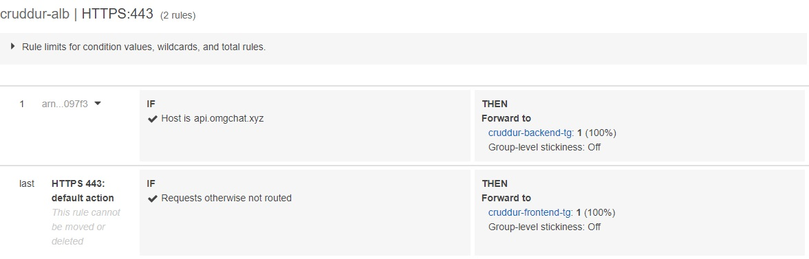

# Week 7 — Solving CORS with a Load Balancer and Custom Domain

- [Application Load Balancer](#application-load-balancer)
- [Domain Configuration](#domain-configuration)
- [Creat Scripts for ECS Fargate and refactor project directory](#creat-scripts-for-ecs-fargate-and-refactor-project-directory)

## Application Load Balancer

Provision and configure Application Load Balancer along with target groups via AWS console:

- Basic configurations: name `cruddur-alb`, Internet-facing, IPv4 address type;
- Network mapping: default VPC, select first three availability zones;

- Security groups: create a new security group named `cruddur-alb-sg`, set inbound rules of HTTP and HTTPS from anywhere, and Custom TCP of 4567 and 3000 from anywhere (set description as TMP1 and TMP2); In addition, edit inbound rules of security group `crud-srv-sg`, instead of anywhere, set port source from `cruddur-alb-sg`, set description of port 4567 as ALBbackend, and port 3000 as ALBfrontend;

- Listeners and routing: HTTP:4567 with a new target group named `cruddur-backend-flask-tg`, select type as IP addresses, set HTTP:4567, set health check as `/api/health-check` with 3 healthy threshold, get its arn to put in `aws/json/service-backend-flask.json`; Add another listener HTTP:3000 with another target group created named `cruddur-frontend-react-js`, don't care about health check, set 3 healthy threshold, get its arn to put in `aws/json/service-frontend-react-js.json`.

## Domain Configuration

I've registered a domain name `omgchat.xyz` for this bootcamp via [porkbun](https://porkbun.com/). We can manage the domain using Route53 via hosted zone, create an SSL certificate via ACM, setup a record set for naked domain to point to frontend-react-js, and setup a record set for api subdomain to point to the backend-flask:

- At Route 53 > Hosted zones, create a new one with the registered domain name and the public type; Copy the values presented in the NS record type, and paste them into the porkbun nameservers (changes to your authoritative nameservers may take up to a couple of hours to propagate worldwide).
- At Certificate Manger, request a public certificate, add domain names of `omgchat.xyz` and `*.omgchat.xyz`, then enter the created certificate and click "Create records in Route 53", finally Route 53 will show two CNAME records.

- At Load Balancers, add a listener to make HTTP:80 redirect to HTTPS:443, and another one to make HTTPS:443 forward to frontend with certificate we created; edit rules for HTTPS:443 to add a new IF which sets Host Header as `api.omgchat.xyz` and sets THEN forward to `cruddur-backend-flask-tg`.
- At Route 53 > Hosted zones > omgchat.xyz, create a record without a record name, set type as "A - Route Traffic to an IPv4 address and some AWS resources", set route traffic as "Alias to Application and Classic Load Balancer" with the right region and load balancer, set routing policy as simple routing; do it again with record name `api.omgchat.xyz`.

> If All is correct and working, you should get access to your App

## Creat Scripts for ECS Fargate and refactor project directory

> All builded scripts for backend you can see [At this comment](https://github.com/sm1lexops/aws-bootcamp-cruddur-2023/commit/07dd4bd456147a5120fe1d4062492e9f363144a6)

> [Scripts for frontend](https://github.com/sm1lexops/aws-bootcamp-cruddur-2023/commit/df2618f81da8f3abf68038b9f90996f26a0ff64b)

> Data showing and Database Connections is correct

> Message Groups is working on Prod

> No Error on Web App Page

