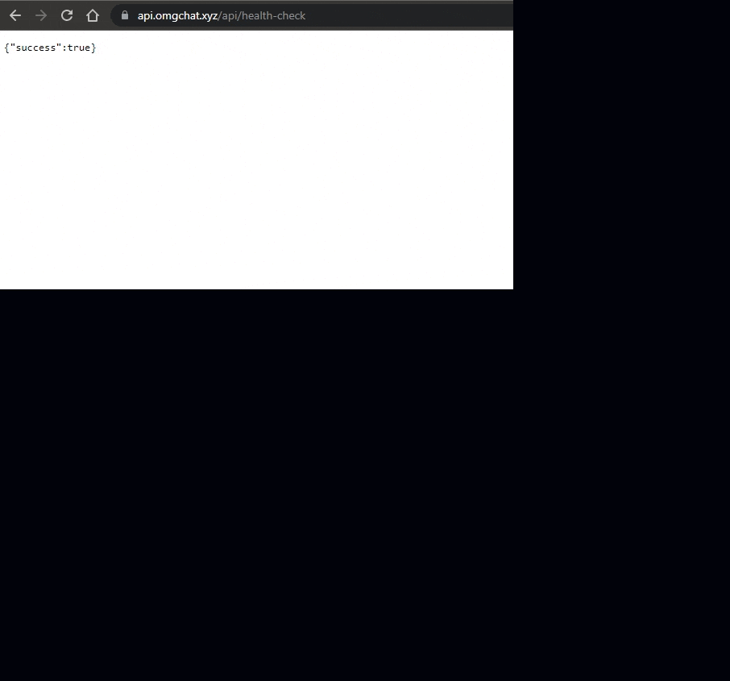

# Week 9 — CI/CD with CodePipeline, CodeBuild and CodeDeploy

This week we'll study how to authomate our continuous integration and continuous delivery/continuous deployment chain.

- [Preparation](#preparation)
- [AWS CodeBuild](#aws-codebuild)
- [AWS CodePipeline](#aws-codepipeline)
- [Test Pipeline](#test-pipeline)

## Preparation

Create the following two scripts:

-  Change the env variables to your owns ([`backend-flask/buildspec.yml`](https://github.com/sm1lexops/aws-bootcamp-cruddur-2023/blob/week-9/backend-flask/buildspec.yml))
-  Policy json for CodeBuild project ([`aws/policies/ecr-codebuild-backend-role.json`](https://github.com/sm1lexops/aws-bootcamp-cruddur-2023/blob/week-9/aws/policies/ecr-codebuild-backend-role.json))

* Create a branch named `prod`, which will be used for AWS CodeBuild and CodePipeline later.

* Check all the ENV variables, in my case, every time I updated the AWS access key and session token, on week 9 I delete the session token and create a long-term access token, when you do, you should update and delete the `AWS_SESSION_TOKEN` in `task-definitions` and in all files containing this ENV

At AWS ECS, update desired tasks in the service to 1, if this was set to 0 before.

> Before this week, if our backend is updated and needed to be deployed into production, we need to run `./bin/backend/build`, `./bin/backend/push`, and `./bin/backend/deploy`. 

> With the following setup, this can be done in a CI/CD fashion.

## AWS CodeBuild

Create a build project:

* name as `omgchat-backend-flask-build`, enable build badge
* source:
  - choose source provider as GitHub, repository in my GitHub account
  - select the `cruddur` repo
  - set source version to `prod`
  - select rebuild every time a code change is pushed to this repository, select single build, select event type as `PULL_REQUEST_MERGED`
* environment:
  - select managed image, select operating system as `Amazon Linux 2`
  - select standard runtime, select the `latest image (4.0)`
  - select environment type as `Linux`, tick `privileged escalation`
  - create a new service role automatically named as `omgchat-backend-flask-build-service-role`
  - decrease timeout to 20 min, don't select any certificate nor VPC
  - select compute as 3 GB memory and 2 vCPUs
    - use a buildspec file `backend-flask/buildspec.yml`
    - no artifects
    - select cloudwatch logs, set group name as `/omgchat/build/backend`, stream name as `backend-flask`

For the newly created service role, attach a policy as shown in `aws/policies/ecr-codebuild-backend-role.json` in order to grant more permissions. Then click "Start build" (or triggered by a merge to the `prod` branch). If succeeded, you can check the build history for details.

## AWS CodePipeline

Create a pipeline:

- name as `omgchat-backend-pipeline`, allow to create a new service role automatically named as `AWSCodePipelineServiceRole-eu-central-1-omgchat-backend-pipeline`, select default location and default managed key in advanced settings
- source stage from GitHub (Version 2), click "Connect to GitHub", set connection name as `cruddur`, install a new app, select the cruddur repo, in the end finish "Connect to GitHub" and back to the pipeline page
- select the cruddur repo and select branch `prod`, select "start the pipeline on source code change" and default output artifact format
- for build stage, select AWS CodeBuild as build provider, select your region, select the newly created project `omgchat-backend-flask-build`
- for deploy stage, select ECS as deploy provide, choose `cruddur` cluster, `backend-flask` service

## Test Pipeline

Update `backend-flask/app.py` by changing the return in `health_check` function from `return {"success": True}, 200` to `return {"success": True, "ver": 1}, 200`.

Now merge this `week-9` branch to the `prod` branch. This will trigger the pipeline we created.

Go to `https://api.<domain_name>/api/health-check`, it will show `{"success":true,"ver":1}`.

Below is a screenshot that proofs my successful pipeline after merging pull request from `week-9`:

