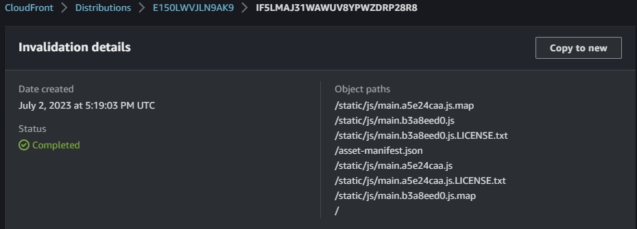

# Week X — Cleanup


## Preparation

* Create [`static-build-frontend`](https://github.com/sm1lexops/aws-bootcamp-cruddur-2023/blob/week-10/bin/frontend/static-build-frontend) script for deploying static web resources

* Run `static-build-frontend` script and Fix main frontend issues [fix#1](https://github.com/sm1lexops/aws-bootcamp-cruddur-2023/commit/bc8cf83cc722dbe3fa8f004bfa5af07fa9b0fe7a) and [fix#2](https://github.com/sm1lexops/aws-bootcamp-cruddur-2023/commit/eee5ff7f55610946c47fb695533fbc022f037bf3)

* Zip all static frontend content to deliver to S3 

* Create or install Gemfile for `aws_s3_website_sync` and `dotenv`

* Create rake file for sync and run sync

* Before run sync script don't forget run `npm install` and `npm build` in frontend dir

> Rake file for sync [`sync-static-s3`](https://github.com/sm1lexops/aws-bootcamp-cruddur-2023/blob/week-x/bin/frontend/sync-static-s3) file:

```ruby
#!/usr/bin/env ruby
puts("==== Installing <gem install aws_s3_website_sync> ====")
require 'bundler/inline'
require 'nokogiri'

gemfile do
  source 'https://rubygems.org'
  gem 'aws_s3_website_sync', require: true
  gem 'dotenv', require: true 
end

require 'aws_s3_website_sync'
require 'dotenv'

env_path = "/workspace/aws-bootcamp-cruddur-2023/erb/sync.env"
Dotenv.load(env_path)

puts "== configuration"
puts "aws_default_region:   #{ENV["AWS_DEFAULT_REGION"]}"
puts "s3_bucket:            #{ENV["SYNC_S3_BUCKET"]}"
puts "distribution_id:      #{ENV["SYNC_CLOUDFRONT_DISTRUBTION_ID"]}"
puts "build_dir:            #{ENV["SYNC_BUILD_DIR"]}"

changeset_path = ENV["SYNC_OUTPUT_CHANGESET_PATH"]
changeset_path = changeset_path.sub(".json","-#{Time.now.to_i}.json")

puts "output_changset_path: #{changeset_path}"
puts "auto_approve:         #{ENV["SYNC_AUTO_APPROVE"]}"

puts("==== Syncing static content with AWS S3 Bucket ====")

puts "sync =="
AwsS3WebsiteSync::Runner.run(
  aws_access_key_id:     ENV["AWS_ACCESS_KEY_ID"],
  aws_secret_access_key: ENV["AWS_SECRET_ACCESS_KEY"],
  aws_default_region:    ENV["AWS_DEFAULT_REGION"],
  s3_bucket:             ENV["SYNC_S3_BUCKET"],
  distribution_id:       ENV["SYNC_CLOUDFRONT_DISTRUBTION_ID"],
  build_dir:             ENV["SYNC_BUILD_DIR"],
  output_changset_path:  changeset_path,
  auto_approve:          ENV["SYNC_AUTO_APPROVE"],
  silent: "ignore,no_change",
  ignore_files: [
    'stylesheets/index',
    'android-chrome-192x192.png',
    'android-chrome-256x256.png',
    'apple-touch-icon-precomposed.png',
    'apple-touch-icon.png',
    'site.webmanifest',
    'error.html',
    'favicon-16x16.png',
    'favicon-32x32.png',
    'favicon.ico',
    'robots.txt',
    'safari-pinned-tab.svg'
  ]
)
```

> You should get All info about changes at your static content and invalidation 

```sh
I, [2023-07-02T17:18:58.148418 #9677]  INFO -- : Runner.run
I, [2023-07-02T17:18:58.148484 #9677]  INFO -- : List.local
I, [2023-07-02T17:18:58.166242 #9677]  INFO -- : List.remote
I, [2023-07-02T17:18:58.317970 #9677]  INFO -- : Plan.delete
I, [2023-07-02T17:18:58.318070 #9677]  INFO -- : Plan.create_update
---[ Plan ]------------------------------------------------------------
ChangeSet: changeset-1688318338

WebSync will perform the following operations:

        update asset-manifest.json
        update index.html
        create static/js/main.a5e24caa.js
        create static/js/main.a5e24caa.js.LICENSE.txt
        create static/js/main.a5e24caa.js.map
        delete static/js/main.b3a8eed0.js
        delete static/js/main.b3a8eed0.js.LICENSE.txt
        delete static/js/main.b3a8eed0.js.map
--------------------------------------------------------------------
ignore: 8   delete: 3   create: 3   update: 2   no_change: 23
...

Invalidation IF5LMAJ31WAWUV8YPWZDRP28R8 has been created. Please wait about 60 seconds for it to finish.
```

